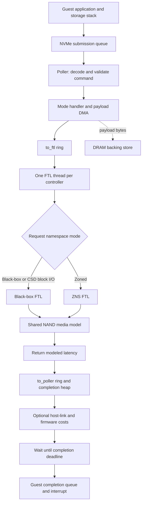
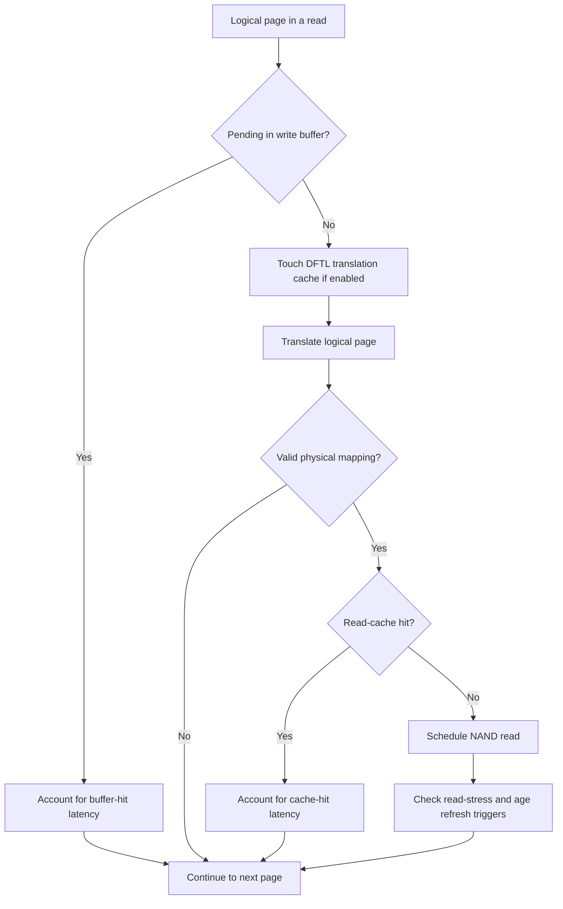
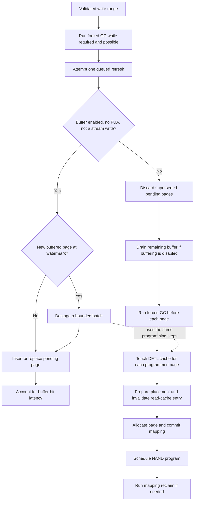
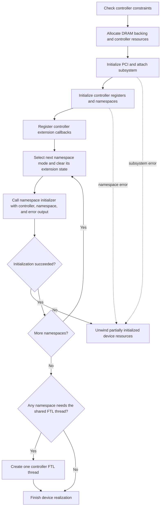
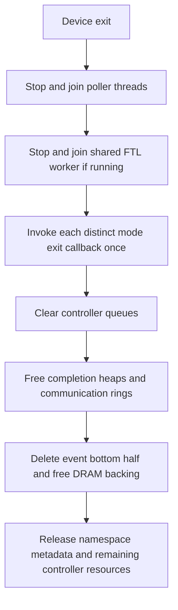

# Architecture

import DesignFigure from '@site/src/components/DesignFigure';

FEMU separates the NVMe command interface, the policy that maps logical data
onto flash, and the model that schedules media operations. Payload bytes live
in a DRAM backend. Mapping and media metadata determine placement and modeled
latency; they do not turn the backend into persistent NAND.

<DesignFigure src="/img/manual/arch-io-write.svg"
  alt="One 4 KiB black-box write over host time: data copied at fetch, program booked on the LUN, completion held until due"
  caption="Figure 1, from the FEMU Manual. One 4 KiB write on BBSSD: the poller copies the payload to the DRAM backend at fetch, the FTL thread books the NAND program on the LUN, and the poller holds the completion until the modeled time. Payload storage and modeled flash placement are separate." />

## Request and completion path

The diagram shows the FTL-thread path. KV and OpenChannel run their own handlers
and timing paths. CSD programs run on their own `femu-csd-cu` compute-unit
threads, and a black-box controller linked to a CXL SSD with `cxl_ssd=<id>`
hands its requests to that medium's FTL. The manual's
[architecture page](/manual/concepts/architecture) lists every thread, including
the CXL SSD's. A pure NoSSD controller can complete eligible I/O inline in
the poller when `hiops_inline=on` and the optional link and firmware models are
off. Mixed namespaces are dispatched by the request's namespace, so a black-box
namespace on a NoSSD controller still receives FTL processing.

A request starts with `stime` and `expire_time` set to the current realtime
clock. The FTL computes `reqlat` and adds it to `expire_time`. The poller uses a
priority queue to post the completion when that deadline is due. Host CPU
scheduling can delay an actual completion beyond the modeled deadline.

`multipoller_enabled` and `poller_ratio` control poller allocation; they do not
create one FTL worker per namespace. `multipoller_enabled=0` runs one poller for
all I/O queues, `1` runs one poller per `poller_ratio` queues, and any other
value fails realize. `queues` takes 1 to 2047 queue pairs. More pollers
therefore do not imply that mapping and GC execute in parallel.

## Black-box data and policy boundaries

A logical-to-physical table and reverse map remain the source of truth for
page, DFTL, hybrid, and FAST mapping. Their differences are translation costs,
allocation classes, and merge behavior. A line spans one block index across
all channels, LUNs, and planes. Closing a line puts it on a full list or a victim
queue; invalidating pages changes its collection priority.

Write buffering tracks logical pages awaiting modeled programming. The read
cache tracks pages whose repeated reads can avoid modeled NAND access. Both
operate over payload data held separately in host memory. See
[policies](/docs/policies) for the actual order and scope of the cost models.

### Read path

The following decisions run for each logical page in `ssd_read`. A buffer hit
skips both translation and NAND. A read-cache hit skips the data NAND read,
but the DFTL translation-cache access has already happened.

The request returns the maximum accumulated latency, with NAND operations
sharing media availability clocks. The arrows show execution order, not an
unconditional sum of every stage's latency. Cache hits also skip the refresh
trigger checks below the NAND read. An unmapped page skips data NAND timing;
under DFTL it can still incur a translation-cache access.

### Write and destage paths

`ssd_write` first handles forced-GC pressure and attempts a queued refresh.
It then chooses buffered admission or direct programming. This diagram shows
the successful paths; exhausted allocation space returns Capacity Exceeded on
either path.

Destaging selects the least recently written pending page and checks free
space and forced GC as it progresses. Hybrid/FAST reclaim runs once per direct
write request or completed destage batch when needed. FUA bypasses buffering
for the request's pages; it does not flush unrelated pending pages. A write
carrying a Streams directive is also programmed directly. Flush uses
the destage path with an unlimited page budget. Payload bytes remain in the
separate DRAM backend throughout these metadata and timing operations.

## Namespace isolation and shared resources

Each namespace receives a backing-store slice and its own extension state.
The controller still owns queues, pollers, the FTL thread, and optional link
and firmware timelines. Two namespaces are therefore not equivalent to two
independent controllers when measuring contention.

`namespace_modes` and `namespace_sizes` require exactly one nonempty entry per
namespace. QEMU command-line list commas must be doubled; the INI helper escapes
them automatically. FDP is restricted to a single namespace. OpenChannel must
be selected at the controller level and is also restricted to one namespace.
A controller takes at most one CSD namespace. KV and FDP cannot share the same
subsystem configuration. Each `namespace_sizes` entry is rounded down to whole
logical blocks (a KV namespace to a sector), and the sizes may add up to all of `devsz_mb`. The manual's
[choosing a mode](/manual/concepts/choosing-a-mode#which-features-combine)
page lists every combination rule.

## Where to extend the implementation

### Device realization and namespace initialization

`femu_realize` creates controller resources before initializing each namespace.
The controller retains its mode's callbacks for administrative and startup
paths. Each namespace receives a callback table for its own mode, with the
state pointer cleared before its initializer runs.

The current initializer signature is
`void init(FemuCtrl *, NvmeNamespace *, Error **)`. It reports failure through
the error output, not an integer return value. Keep namespace state independent:
copying an initialized state pointer would alias mappings or key spaces between
namespaces. `FemuExtCtrlOps` also includes `admin_cmd_cqe` for administrative
handlers that need completion data; inspect the current header before adding a
mode rather than copying an older callback definition.

On a controller that shares its namespaces through a `femu-subsys` with
`ns_mgmt=on`, the second and later controllers skip the per-namespace loop and
use the subsystem's namespaces. A controller with `cxl_ssd=<id>` attaches to the
CXL medium just before the FTL thread decision.

Successful realization does not prove that a guest has created queues or run
I/O. Initialization tests and guest workload tests cover different stages.

### Device shutdown and partial initialization

The shutdown arrows below show call order in `femu_exit`, not I/O completion
guarantees. Pollers produce work for the shared FTL worker, so shutdown joins
the pollers first. Both must stop before mode state or communication rings
are released.

Between the FTL worker and the mode callbacks, `femu_exit` also closes the
persistent event log and detaches a linked CXL SSD. A controller that uses a
subsystem's shared namespaces skips the mode callbacks, namespace release and
DRAM free, because the subsystem owns them.

`FemuExtCtrlOps.exit` takes a controller, not a namespace. The dispatcher
collects distinct exit function pointers from the controller and namespace
tables; it calls a shared handler once even when several namespaces use it.
Each handler must release the namespace state it owns. The separate
`ns_exit` callback, which only the black-box mode sets, releases one namespace's
state when that namespace is released. A new mode must account
for mixed-mode controllers and partially initialized namespaces.

Initialization failures take the separate `femu_realize_undo` path. It invokes
mode cleanup before releasing the namespace array, subsystem registration,
backing memory, and other allocated resources. The shared FTL worker starts
only after every namespace initializer succeeds, so this rollback precedes
worker startup. Do not infer that the normal shutdown sequence runs on an
initialization failure.

For a lifecycle change, test failed initialization after earlier namespaces
have succeeded, exit before the guest enables the controller, and removal
after I/O. Check retained allocations and worker access to released state.
These are validation cases to run; source ordering alone does not establish
leak freedom or completion of outstanding guest commands.

### Extension locations

| Change | Primary location | Contract to preserve |
| --- | --- | --- |
| Add a device property | `femu.c` | Validate it before allocation and initialization |
| Add a mapping scheme | `bbssd/ftl-map.c` and `femu_mapping_ops` | Translate, prepare/commit writes, relocate, trim, and teardown |
| Add a GC policy | `bbssd/ftl-line-gc.c` | Remove selected victims from the correct queue and maintain counts |
| Add NAND scheduling behavior | `nand/nand-media.c` | Shared operation timing and adapter-selected policies |
| Change a mode's command handling | Mode directory and extension operations | Validate namespace, bounds, transfer sizes, and completion status |
| Add an experiment counter | `nvme-admin.c` and `FemuStatsLog` | Preserve the public log layout and units |

The [timing guide](/docs/timing-model) explains why the same media API can produce
different behavior in different modes.

## Implementation sources

Reviewed against FEMU [`39a55eeb6`](https://github.com/MoatLab/FEMU/tree/39a55eeb637b23c26b3a2ce9254399c9e0b1b3be). The examples describe this revision; see [validation coverage](/docs/implementation#validation-coverage).

- [femu.c](https://github.com/MoatLab/FEMU/blob/39a55eeb637b23c26b3a2ce9254399c9e0b1b3be/hw/femu/femu.c): femu_ftl_thread, femu_ftl_process_req, namespace initialization
- [nvme.h](https://github.com/MoatLab/FEMU/blob/39a55eeb637b23c26b3a2ce9254399c9e0b1b3be/hw/femu/nvme.h): FemuExtCtrlOps and namespace state
- [nvme-io.c](https://github.com/MoatLab/FEMU/blob/39a55eeb637b23c26b3a2ce9254399c9e0b1b3be/hw/femu/nvme-io.c): submission processing, DMA, completion scheduling
- [backend/dram.c](https://github.com/MoatLab/FEMU/blob/39a55eeb637b23c26b3a2ce9254399c9e0b1b3be/hw/femu/backend/dram.c): volatile payload storage
- [bbssd/ftl-map.c](https://github.com/MoatLab/FEMU/blob/39a55eeb637b23c26b3a2ce9254399c9e0b1b3be/hw/femu/bbssd/ftl-map.c): mapping operation registry
- [bbssd/ftl-datapath.c](https://github.com/MoatLab/FEMU/blob/39a55eeb637b23c26b3a2ce9254399c9e0b1b3be/hw/femu/bbssd/ftl-datapath.c): read ordering, buffered admission, direct programming, and destaging
