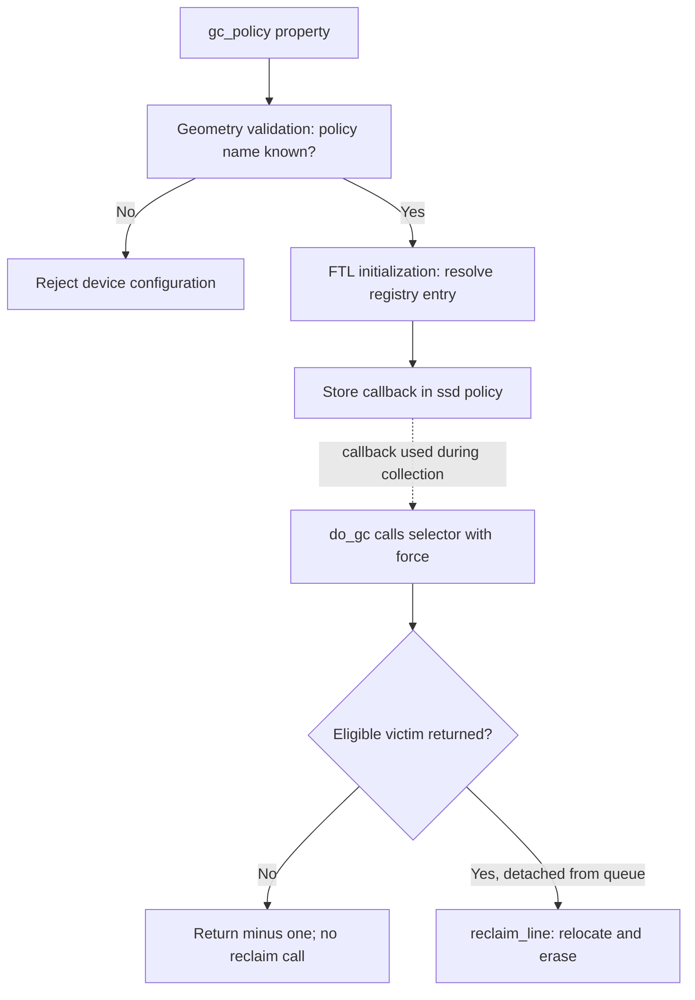

# Developer learning path

Start with a standalone test, follow one request when you have a working device,
then make a focused change. The [first model test](/docs/community/first-test)
provides a complete exercise without a guest or KVM. This path uses FEMU commit
[`9d176f89`](https://github.com/MoatLab/FEMU/tree/9d176f89138dfb00dcd2fba2aa61072268d9bf4a).
Record your own commit before comparing function names or results.

## Choose a first task

| Your goal | Start here | Evidence to bring back |
| --- | --- | --- |
| Run an experiment | [Get started](/docs/start), then [first experiment](/docs/start-first-experiment) | Device configuration, guest tools, and workload command |
| Understand a policy | [Policy guide](/docs/policies) and its linked source | A trace of when the policy runs and which state it changes |
| Fix a model defect | The standalone test below | A failing assertion, the change, and the passing result |
| Improve a tutorial | Repeat a [configuration recipe](/docs/configuration-recipes) | Missing prerequisite or incorrect step, with actual output |
| Add a feature | Open a [design discussion](https://github.com/MoatLab/FEMU/discussions) | User problem, mode, command or property boundary, and proposed tests |

These are contribution categories, not a claim that specific issues are
available or assigned. Check [open issues](https://github.com/MoatLab/FEMU/issues)
before starting a change that overlaps someone else's work.

## 1. Establish a baseline

Prepare the pinned checkout using [Your first model test](/docs/community/first-test#1-run-the-unchanged-test).
Run commands below from that checkout root unless a step says otherwise:

```bash
git rev-parse HEAD
git status --short
make -C hw/femu/tests check
```

The standalone test builds the NAND media model against a small QEMU-header
stub. It needs a C compiler and Make, but no guest, KVM, or complete QEMU build.
At the pinned revision, it reports 46 passing assertions in TAP format.
This establishes arithmetic and scheduling behavior covered by those assertions;
it does not test NVMe command handling or all mode integrations.

Read the [test source](https://github.com/MoatLab/FEMU/blob/9d176f89138dfb00dcd2fba2aa61072268d9bf4a/hw/femu/tests/unit/test-nand-media.c)
and locate `bb_config()`, `reset_timelines()`, and `check()`.
Explain why carrying an old LUN completion time into a new independent case
would change its expected latency. Your first checkpoint is a passing baseline
and a written explanation of the test's timeline state.

### Check memory and undefined behavior

When changing the media model, also run the standalone test with compiler
sanitizers. The following commands passed all 46 baseline assertions with
Apple Clang on macOS. They require a compiler and runtime that support
AddressSanitizer and UndefinedBehaviorSanitizer.

```bash
make -C hw/femu/tests clean
make -C hw/femu/tests check CC=cc \
  CFLAGS_LIB='-O1 -g -Wall -std=gnu11 -fsanitize=address,undefined -fno-omit-frame-pointer -fno-sanitize-recover=all' \
  CFLAGS_TEST='-O1 -g -Wall -Wextra -Werror -std=gnu11 -fsanitize=address,undefined -fno-omit-frame-pointer -fno-sanitize-recover=all'
```

Both the model object and test executable need these flags. Clean before
changing flags: this Makefile tracks source timestamps, so an existing binary
can otherwise run without being rebuilt. A successful run ends with `1..46`
and no sanitizer report, or `1..49` after the first-test exercise. A sanitizer
failure includes a diagnostic and fails the command; save that output with the
compiler version and reproducing input.

These checks cover the standalone cases executed. They do not exercise the
controller, DMA, FTL worker concurrency, or guest integration. To return to the
ordinary build, clean again and run `make -C hw/femu/tests check`.

## 2. Follow one black-box write

Use the [architecture diagram](/docs/architecture) beside these source locations:

| Step | Function | File under `hw/femu/` | What to inspect |
| --- | --- | --- | --- |
| Poll and decode | `nvme_process_sq_io()` | `nvme-io.c` | Submission-queue head and decoded command |
| Dispatch | `nvme_io_cmd()` | `nvme-io.c` | Namespace selection and mode handler |
| Validate and move payload | `nvme_rw()` | `nvme-io.c` | LBA bounds, `nlb + 1` decoding, namespace backend offset |
| Dispatch FTL work | `bb_ftl_process_req()` | `bbssd/ftl.c` | Carried error status and opcode |
| Update mapping | `ssd_write()` | `bbssd/ftl-datapath.c` | Logical page, new physical page, overwritten-page invalidation |
| Charge media time | `ssd_advance_status()` | `bbssd/ftl-media.c` | NAND operation, timeline gate, returned latency |
| Post completion | `nvme_post_cqe()` | `nvme-io.c` | Completion status and guest completion queue |

For interactive tracing, first follow the [build instructions](/manual/getting-started/build)
and prepare a [guest image](/manual/getting-started/guest-image).
Configure a separate debug build with `--enable-debug`
in addition to the options used by the build guide. Start GDB with the same
guest image and complete device arguments as your working launch. Set
breakpoints on `nvme_rw`, `bb_ftl_process_req`, and `ssd_write`; use `bt`,
`info threads`, and `info locals` to follow the request. Static functions can
be located by source file when GDB reports an ambiguous name.

In the guest, identify an **expendable FEMU namespace** with `nvme list` and
`lsblk`. A direct write overwrites data at the selected device's start:

```bash
# Replace this example only after identifying the intended FEMU namespace.
FEMU_TEST_DEVICE=/dev/nvme0n1
sudo dd if=/dev/zero of="$FEMU_TEST_DEVICE" bs=4096 count=1 oflag=direct
```

Your checkpoint is a trace that distinguishes payload movement, mapping state,
modeled completion time, and the posted completion. Debugger pauses alter host
timing, so collect benchmark results in a separate run without breakpoints.

### Correlate one request across threads

For the ordinary black-box path, stop at `bb_ftl_process_req` after I/O
validation and payload transfer. Select a successful write before examining its
decoded LBA fields. In GDB, the following breakpoint filters by opcode and
carried status at the reviewed revision. Once the guest has booted, interrupt
GDB with Ctrl+C in the host terminal, set this breakpoint, and resume execution:

```text
break bb_ftl_process_req if req->cmd_opcode == 1 && req->status == 0
continue
```

Issue the single guest write above after the guest is ready. At the stop, record
the queue, command ID, namespace, LBA range, and start time. Check that these
match the intended request; other guest activity can also trigger the breakpoint.

```text
set $femu_req = req
p req->sq->sqid
p req->cqe.cid
p req->cmd.nsid
p req->slba
p req->nlb
p req->stime
bt
info threads
break ssd_write if req == $femu_req
break nvme_post_cqe if req == $femu_req
continue
```

`req->nlb` is the decoded block count; the command's NLB field is zero-based.
Command fields such as NSID and CID retain their little-endian representation,
which can be read directly on the documented x86-64 host. The queue ID and CID
together distinguish outstanding commands within a controller. Also retain the
namespace and start time when comparing trace records.

| Stop | Inspect | Interpretation |
| --- | --- | --- |
| `bb_ftl_process_req` entry | `req->status`, `slba`, `nlb`, `cmd_opcode` | Failed validation skips FTL processing; decoded LBA fields can be stale on that error path |
| `ssd_write` entry | Request identity and the selected `ssd` | The FTL worker is handling the selected namespace's write; local LPN variables are initialized later |
| `nvme_post_cqe` entry | `req->status`, `reqlat`, `expire_time`, `cq->cqid` | Inspect the request status here; the function has not yet encoded the completion status and phase into the CQE |

Use `continue` between stops so the poller and FTL worker can both run. Do not
lock execution to one thread while waiting for work that another thread must
perform. A stop at the FTL entry cannot reconstruct the earlier DMA operation;
use a separate trace at `nvme_rw` for that stage.

After the completion stop, remove these breakpoints using their numbers from
`info breakpoints`. The poller returns the request object to the submission
queue's free list, so its pointer can identify a different command later. Guest
command IDs can also be reused after completion. These instructions are checked
against source; the interactive guest session remains unexecuted in this review.

## 3. Compare two configurations

Start with the [black-box baseline](/docs/configuration-recipes#baseline-geometry-and-space)
and change one supported policy. Keep geometry, exposed capacity, workload,
preconditioning, and source commit fixed. Check the
[compatibility boundaries](/docs/policies) before combining options.

Use [counter snapshots](/docs/observability) before and after the workload.
Explain both the observed result and the code path that predicts it. A useful
comparison can show no difference, for example when the workload never causes
GC and the changed option only selects a GC victim.

When plotting the comparison, follow the
[figure checklist](/docs/research/reproducibility#make-a-policy-comparison-readable)
to label the exact policies, measurement boundary, and repetition statistics.

## 4. Add a regression test

For a media-timing defect, add a focused case to
`hw/femu/tests/unit/test-nand-media.c`. Initialize the model and reset timelines
explicitly. Derive an expected completion time from the
[timing equations](/docs/timing-model); do not copy the implementation into the
test. Confirm that the assertion fails before the fix and passes afterward.

For a command, namespace, or FTL defect, use an appropriate controller or guest
test as well. A NAND unit test alone cannot verify command status, DMA length,
namespace isolation, or guest-visible behavior. Report the configurations and
modes exercised in your pull request.

For parameterized policy tests, pass each case's setting into the configuration
or function under test and record the effective value. A test named `lru` does
not establish LRU coverage if initialization still selects CLOCK. Include a
sequence that distinguishes the policies being compared, as in the
[LRU/2Q example](/docs/policies#trace-a-cache-comparison). Keep argument expansion
checks separate from tests of the selected policy's behavior.

## 5. Extend an existing boundary

Before adding a new NVMe command, inspect existing opcode dispatch, data-transfer
validation, and the feature advertisement seen by the guest. Before adding a
mode, inspect `FemuExtCtrlOps`, per-namespace initialization, dispatch, teardown,
and property compatibility in `nvme.h` and `femu.c`.

Follow the [shutdown and rollback sequence](/docs/architecture#device-shutdown-and-partial-initialization)
before adding owned state. Identify which callback releases it, whether that
callback can see a partially initialized namespace, and which workers must stop
first. The exit dispatcher calls each distinct mode handler once per controller;
the handler is responsible for its namespaces. Include failure during setup
and removal after I/O in the proposed validation.

The existing [statistics log](/docs/observability) is a useful reading exercise:
trace `FemuStatsLog` to its handler in `nvme-admin.c`, then compare the output
layout with the downloadable decoder. It already exposes statistics through
Get Log Page; reading that path avoids introducing a second, incompatible
statistics interface as a first exercise.

Your design should specify invalid inputs, units, ownership and cleanup,
default behavior, affected modes, and guest-visible changes. Link the proposal
from a discussion or issue before investing in a large implementation.

### Worked boundary: add a line-GC selector

For an ordinary black-box victim-selection experiment, extend
`femu_ftl_policy_ops` rather than duplicating relocation. Its interface in
`hw/femu/bbssd/ftl.h` contains a name and
`select_victim_line(struct ssd *, bool force)` callback. The existing selectors
and `femu_ftl_policies` registry live in
[ftl-line-gc.c](https://github.com/MoatLab/FEMU/blob/9d176f89138dfb00dcd2fba2aa61072268d9bf4a/hw/femu/bbssd/ftl-line-gc.c#L455).



The arrows separate setup from collection; they do not describe the frequency
of GC. [GC pressure and line states](/docs/policies#ordinary-garbage-collection)
determine when the selector can matter.

1. Implement the selection rule and add its name/callback to
   `femu_ftl_policies`. Both `femu_ftl_policy_known()` and
   `femu_ftl_policy_lookup()` scan that registry. The lookup has a greedy
   fallback, but `ftl-geom.c` rejects an unknown nonempty name during validation.
2. Preserve queue ownership. A successful selector removes exactly one victim,
   clears its `pos`, and decrements `victim_line_cnt` once. A rejected candidate
   remains queued. The random selector demonstrates reinsertion after popping
   an ineligible candidate; the scanning selectors reject before removal.
3. Define the `force` behavior. Existing selectors require at least
   `pgs_per_line / 8` invalid pages for background collection. Forced collection
   bypasses that qualification. They return `NULL` when there is no candidate.
   State explicitly if the proposed policy changes these semantics.
4. Keep relocation in `reclaim_line()`. The callback selects a line; `do_gc()`
   passes it to the shared reclamation path. This interface has no private-state
   initialization or cleanup callbacks. Adding policy-owned state requires an
   explicit lifecycle design.

Use these cases when designing the regression harness:

| Case | Expected evidence |
| --- | --- |
| Empty victim queue | `NULL`, unchanged queue count, no reclamation |
| Candidate below background threshold | Rejection preserves membership, count, and usable queue position |
| Same candidate with `force=true` | Exactly one detached victim and one count decrement |
| Multiple eligible candidates | Independently calculated ranking, including ties and any zero denominator |
| New name and misspelled name | New name resolves to its callback; typo fails device validation |
| FDP enabled with the new selector | Initialization rejects the unsupported non-greedy `gc_policy` |

FDP uses its own reclaim-unit path; registering a line selector does not extend
`gc_strategy`. Preserve that boundary in
[bb.c](https://github.com/MoatLab/FEMU/blob/9d176f89138dfb00dcd2fba2aa61072268d9bf4a/hw/femu/bbssd/bb.c#L120).
Provide a complete configuration derived from the
[GC comparison recipe](/docs/configuration-recipes#policy-experiments), document the selector's
ranking and cost in the policy guide, and update affected design diagrams.
The standalone NAND test does not exercise this callback. Report selector
harness results separately from device initialization and guest readback under
GC pressure. This is a source-reviewed extension plan, not a tested new policy.

The existing five selectors have also passed an isolated 34-case contract
check covering the selection and queue behavior above. See
[validation coverage](/docs/implementation#validation-coverage) for its reduced
structures, fixed clock, and untested device/guest boundaries. In particular,
the registry predicate check does not instantiate a device or exercise FDP
rejection.

## 6. Submit a reviewable change

Follow [Contributing](/docs/community/contributing). Include the problem,
reproduction, expected behavior, test output, and any remaining limitation.
For a new configuration property, document its units, default, valid values,
mode restrictions, and interaction with existing policies. For a diagram or
tutorial, link the source revision used to verify it.
