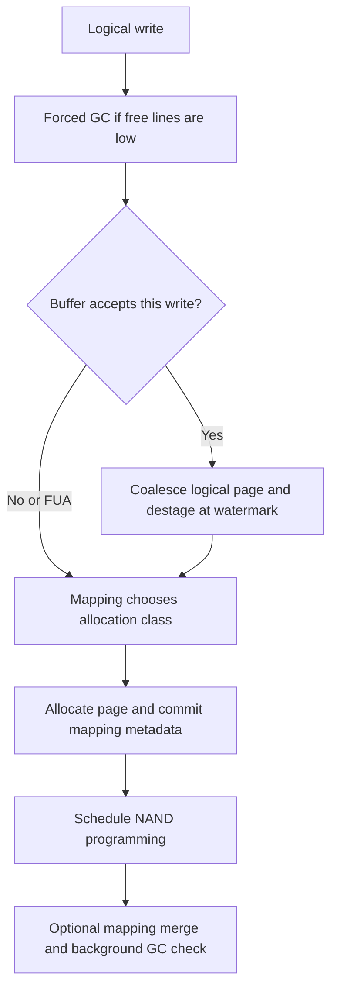

# Black-box SSD

:::tip[Design note]

This page traces the BlackBox SSD implementation through the source. For launch lines, guest commands, limits and verification, use the [BlackBox SSD guide in the FEMU Manual](/manual/modes/blackbox).

:::

`femu_mode=1` presents an ordinary block-addressed NVMe namespace. The guest
chooses logical block addresses; FEMU owns placement, mapping, garbage
collection, and modeled flash timing. Start with the
[black-box recipe](/configs/blackbox.conf).

## Implemented behavior

- Reads translate logical pages, optionally consult caches, and reserve media time.
- Writes allocate new physical pages and invalidate superseded mappings.
- GC selects victim lines and relocates valid pages before erase.
- DSM deallocation and Write Zeroes have explicit datapaths and capability gates.
- Optional mapping, caching, buffering, refresh, error insertion, and timing
  policies extend the baseline without changing its command interface.

The diagram groups the write stages; the source's mapping commit performs the
metadata update before the media timing call. Payload transfer is handled by
the controller/backend path, separately from these FTL metadata transitions.

## Configure by question

| Question | Controls | Detail |
| --- | --- | --- |
| How much space and parallelism? | Seven geometry axes, `devsz_mb`, `op_pcent` | [Capacity and reserve](/docs/policies#capacity-and-placement) |
| Which mapping and merge behavior? | `mapping`, `mapping_cache_mb` | [Mapping schemes](/docs/policies#mapping-schemes) |
| Which victim should GC choose? | `gc_policy`, both threshold percentages | [Ordinary GC](/docs/policies#ordinary-garbage-collection) |
| Can locality avoid media accesses? | `read_cache_mb`, `cache_evict`, `buffer_size` | [Cache policies](/docs/policies#read-cache) |
| What time does NAND consume? | Flat or cell-type latency, bus phases, suspend | [Timing model](/docs/timing-model) |
| How should errors or refresh appear? | Periodic error rates, read/age limits, ECC tiers | [Reliability experiments](/docs/policies#write-buffer-refresh-and-error-experiments) |

## Validate the case

Identify the namespace, confirm exposed capacity, precondition it, and run the
[first experiment](/docs/start-first-experiment). Read the vendor counters
before and after. A GC comparison needs sustained overwrites and observed
relocation activity, not just a first write into empty space.

The default geometry describes 16 GiB raw, while default `devsz_mb` exposes
1 GiB. Those are separate quantities. Preserve sufficient reserve whenever
changing either; initialization refuses configurations that leave GC no room.

## Implementation sources

Reviewed against FEMU [`39a55eeb6`](https://github.com/MoatLab/FEMU/tree/39a55eeb637b23c26b3a2ce9254399c9e0b1b3be). The examples describe this revision; see [validation coverage](/docs/implementation#validation-coverage).

- [bbssd/bb.c](https://github.com/MoatLab/FEMU/blob/39a55eeb637b23c26b3a2ce9254399c9e0b1b3be/hw/femu/bbssd/bb.c): initialization and capacity validation
- [bbssd/ftl-datapath.c](https://github.com/MoatLab/FEMU/blob/39a55eeb637b23c26b3a2ce9254399c9e0b1b3be/hw/femu/bbssd/ftl-datapath.c): read/write, buffer, zeroes and trim
- [bbssd/ftl-line-gc.c](https://github.com/MoatLab/FEMU/blob/39a55eeb637b23c26b3a2ce9254399c9e0b1b3be/hw/femu/bbssd/ftl-line-gc.c): line allocation and collection
