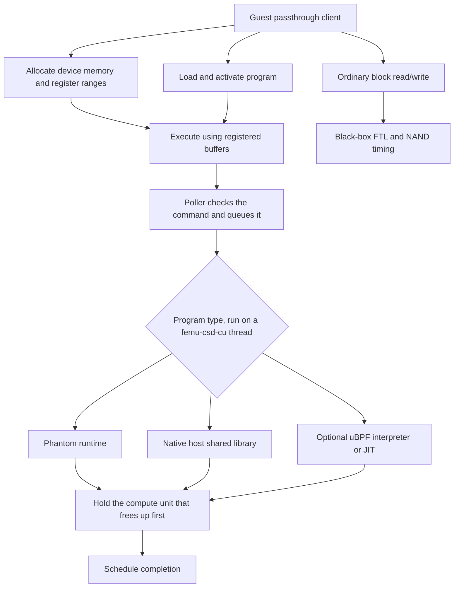

# Computational storage

:::tip[Design note]

This page traces the CSD implementation through the source. For launch lines, guest commands, limits and verification, use the [CSD guide in the FEMU Manual](/manual/modes/csd).

:::

`femu_mode=4` combines a block-backed namespace with computational-storage
commands. It supports device-memory allocation, memory-range registration,
program loading and activation, and execution. Program types include phantom
runtime, native shared libraries, and eBPF when FEMU is built with uBPF support.

## Data and compute paths



## Configuration

Use [csd.conf](/configs/csd.conf). It exposes 4 GiB on the baseline black-box
geometry, provides 64 MiB of device memory, and models four compute units.

| Property | Actual role |
| --- | --- |
| `fdm_size` | Device-memory capacity in MiB; must be nonzero |
| `nr_cu` | Compute units, from 1 to 64; each is a `femu-csd-cu` host thread that runs programs |
| `csf_runtime_scale` | Nonzero scale for measured host runtime when the command has no explicit runtime |
| `csd_program_dir` | Host directory containing permitted program files |
| `nr_thread` | No effect, kept for CEMU compatibility; CSD still refuses 0, and a value other than the default warns at realize |
| `time_slice`, `context_switch_time` | No effect, kept for CEMU compatibility; a value other than the default warns at realize |

The poller checks an Execute command and hands it to one of the `nr_cu`
compute-unit threads, which runs the program and posts the completion, so a
long program holds neither a poller nor the admin queue. Pending runs are
taken in arrival order, skipping a run whose program is already busy. For the
modelled completion time, the run holds the compute unit that frees up first:
a run with a known runtime takes its unit at submission, and a run without one
is charged its measured host execution time, scaled by the program's factor or
the device's `csf_runtime_scale`. Group and QoS fields are stored, but the
scheduler does not arbitrate by priority or deadline. Do not interpret those
accepted fields as measured scheduling features. The
[CSD guide](/manual/modes/csd) describes how programs run in more detail.

Native programs execute in the emulator process. `csd_program_dir` restricts
file resolution, but does not turn native libraries into sandboxed device code.
Use programs you intend to execute on that host.

## Build and run the probes

The source tree provides native host libraries and a Linux guest passthrough
client. Build the client for the guest's architecture and userspace; its source
requires the Linux `nvme_ioctl.h` header. Build the shared library for the host
process running FEMU. When both environments are compatible Linux systems,
these targets can be built together from the checkout root:

```bash
make -C hw/femu/tests/csd csd-passthru csd-vadd.so
```

Put `csd-vadd.so` in a chosen host directory, set `csd_program_dir` to that
absolute directory, and copy the client executable into a compatible Linux
guest. The guest requests a filename within the configured directory:

```bash
sudo ./csd-passthru /dev/nvme0n1 smoke
sudo ./csd-passthru /dev/nvme0n1 smoke-so csd-vadd.so
```

For uBPF, build the emulator with its optional uBPF integration and build the
sample ELF with `make -C hw/femu/tests/csd bpf`. The client also provides
`smoke-ubpf`, `smoke-mrs`, and vector-add examples. A program-loading failure
should be resolved before measuring runtime.

CSD's ordinary block I/O uses the black-box FTL and needs GC reserve. Its compute
runtime is a host-derived or explicitly supplied model; it does not reproduce
a hardware accelerator's instruction pipeline, memory hierarchy, or scheduler.

## Probe targets and expected results

Use an isolated test controller with CSD namespace ID **1**. The client's
command structures hard-code that ID; changing the device path does not select
another namespace for its admin commands. Use the conventional namespace path,
such as `/dev/nvme0n1`: the client derives `/dev/nvme0` by truncating the namespace
suffix, rather than resolving an arbitrary device alias through sysfs.

| Guest operation | What it checks | Final success message |
| --- | --- | --- |
| `smoke` | Allocate 4 KiB, write/read and compare it, then load and execute a phantom program | `AFDM smoke passed` |
| `smoke-so csd-vadd.so` | Native vector addition over 1,024 integer pairs, with every result checked | `shared-library smoke passed` |
| `smoke-ubpf csd-vadd.bpf.o 0` | Vector addition through the uBPF interpreter | `uBPF smoke passed` |
| `smoke-ubpf csd-vadd.bpf.o 1` | Request JIT execution of the same test | `uBPF smoke passed` |
| `smoke-mrs csd-vadd.so` | Register input/output memory ranges and verify native vector addition through them | `MRS shared-library smoke passed` |

Pass only the program filename from `csd_program_dir`, even though the client's
usage text calls it a host-visible path. The emulator rejects names containing
directory components. The uBPF tests require the optional integration and the
BPF object in that directory; a passing native test does not validate uBPF.

Save stdout, stderr, and the immediate process exit status for each operation.
The smoke routines exit on command or comparison failure, and return success
only after their normal cleanup. Failures can leave allocated device memory,
loaded programs, or registered ranges behind. Start a fresh emulator for an
independent retry if cleanup has not been verified. Run these probes serially:
phantom and native smoke reuse program ID 1, uBPF uses 5, and MRS uses 7.

These are source-derived checkpoints; the [CSD guide](/manual/modes/csd)
carries the guest-tested commands and their outputs. They do not validate concurrent clients, scheduling fairness, or measured hardware
acceleration. The phantom smoke checks command execution and memory round-trip,
not a computation result or a measured runtime guarantee.

## Implementation sources

Reviewed against FEMU [`39a55eeb637b`](https://github.com/MoatLab/FEMU/tree/39a55eeb637b23c26b3a2ce9254399c9e0b1b3be). The examples describe this revision; see [validation coverage](/docs/implementation#validation-coverage).

- [csd/csd.c](https://github.com/MoatLab/FEMU/blob/39a55eeb637b23c26b3a2ce9254399c9e0b1b3be/hw/femu/csd/csd.c): initialization, program loading, memory commands, execution and compute-unit threads
- [csd/csd.h](https://github.com/MoatLab/FEMU/blob/39a55eeb637b23c26b3a2ce9254399c9e0b1b3be/hw/femu/csd/csd.h): command and kernel interfaces
- [tests/csd/csd-passthru.c](https://github.com/MoatLab/FEMU/blob/39a55eeb637b23c26b3a2ce9254399c9e0b1b3be/hw/femu/tests/csd/csd-passthru.c): guest smoke tests
- [tests/csd/Makefile](https://github.com/MoatLab/FEMU/blob/39a55eeb637b23c26b3a2ce9254399c9e0b1b3be/hw/femu/tests/csd/Makefile): sample-kernel and client build targets
