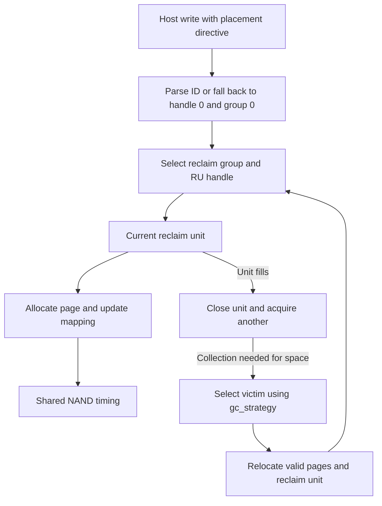

# Flexible Data Placement

:::tip[Design note]

This page traces the FDP implementation through the source. For launch lines, guest commands, limits and verification, use the [FDP guide in the FEMU Manual](/manual/features/fdp).

:::

import DesignFigure from '@site/src/components/DesignFigure';

FDP runs on the black-box controller (`femu_mode=1`) with placement enabled on
a linked `femu-subsys`. The host supplies placement identifiers; FEMU maps them
to reclaim-unit handles and places data into reclaim units. It is not a
separate numeric FEMU mode.

## Placement and reclamation

<DesignFigure src="/img/manual/fdp-placement.svg"
  alt="FDP placement: a placement identifier picks a placement handle, the namespace maps it to a reclaim unit handle, and the handle fills its current reclaim unit"
  caption="Figure 1, from the FEMU Manual. A placement identifier selects a handle, not a physical reclaim unit. The handle fills its current reclaim unit, one FTL line, before taking a free one." />



One reclaim unit is one geometry-derived superblock/line at this revision. For
eight channels, eight LUNs, one plane, 256 pages per block, and 4 KiB pages, that
is 64 MiB. The implementation refreshes the advertised unit size from geometry.
An explicit `fdp.runs` must match it.

### Follow a write through the handle table

1. `ssd_stream_write_lpns()`, called from `ssd_stream_write()`, reads the saved
   directive type and placement identifier from the request. `nvme_parse_pid()` checks the decoded placement handle and
   reclaim group against the namespace and endurance-group limits.
2. For a valid directive, `ns->fdp.phs[ph]` resolves the placement handle to a
   reclaim-unit handle (RUH). A handle is an indirection: its `curr_ru` points
   to the unit receiving new writes, rather than permanently naming one unit.
3. The allocator assigns a physical page, updates the logical and reverse maps,
   and advances the RU write pointer. Filling a unit can rotate the handle to
   a new free unit. Lack of free units can require collection or produce a
   capacity failure; selecting FDP does not provide unlimited stream capacity.
4. The media adapter schedules programming. Statistics are charged from pages
   actually programmed, including partial progress, rather than assuming every
   requested byte was written successfully.

### Missing and invalid placement identifiers

| Ordinary write input | Placement used by this implementation |
| --- | --- |
| Valid data-placement directive | Decoded placement handle and reclaim group |
| No data-placement directive | Placement handle 0, reclaim group 0 |
| Data-placement directive with invalid ID | Placement handle 0, reclaim group 0; an invalid-ID event is conditional on the default handle's event filter |

Invalid placement does not, by itself, reject an ordinary write in this path.
Successful completion therefore does not prove that the application exercised
its intended handle. Inspect handle usage and event settings alongside command
status. This fallback describes writes; the separate reclaim-unit-handle update
command validates its identifier list and can reject invalid entries.

### Where collection moves surviving pages

`fdp_gc_frontier()` distinguishes isolation types. Persistently isolated
handles obtain a separate GC unit charged to that handle. The initially
isolated handle is the last one in the handle array, and collection relocates
into its active unit, shared with host writes. Consequently,
host placement and GC relocation need not use the same destination mechanism.
Keep isolation mode fixed when comparing `gc_strategy`, and report actual
reclamation rather than only successful host writes. These paths were reviewed
in source; for guest-tested placement with `nvme write` and fio, and WAF with
and without placement, follow [tutorial 04](/manual/tutorials/04-fdp).

## Configuration

Use [fdp.conf](/configs/fdp.conf) with the
[configuration helper](/docs/configuration-recipes). The relevant object split is:

```ini
[device]
mode = bbssd
devsz_mb = 4096
namespaces = 1
gc_strategy = 0
[subsys]
fdp = on
fdp.nruh = 4
fdp.nrg = 1
fdp.nru = 256
```

The download also pins all black-box geometry and timing settings. The helper
emits a subsystem, a device, and the `subsys` link automatically.

| Control | Behavior |
| --- | --- |
| `fdp.nruh` | Number of reclaim-unit handles |
| `fdp.nrg` | Reclaim-group count; this revision requires exactly one |
| `fdp.nru` | Configured reclaim-unit pool limit, constrained by geometry |
| `fdp.isolation_mode=0` | All handles persistently isolated |
| `fdp.isolation_mode=1` | Last handle initially isolated, remaining handles persistently isolated |
| `gc_strategy=0/1/2/4` | Greedy, cost-benefit, random, or per-handle pressure selection |
| `fdp_trim_erase_all=0` | Ordinary range-specific deallocation; nonzero selects a whole-device reset experiment |

Leave the whole-device trim experiment disabled for ordinary filesystem tests.
The required initial RU pool is checked against handles, groups, and spare
allocation. Capacity validation then keeps one open unit per handle and group,
one collection unit per persistently isolated handle, and the units forced
collection keeps free, and refuses a namespace larger than what remains (see
[the reserve](/manual/design/fdp#configuration)). Increasing handles without
increasing available units can fail at initialization.

## Compatibility boundaries

FDP supports one namespace. KV plus FDP is rejected, and so are LBA metadata
(`meta`) and namespace management. The following ordinary
black-box controls are rejected under FDP because its separate path does not
implement them: `buffer_size`, `hot_cold_sep`, `read_reclaim_limit`,
`retention_limit_sec`, `ecc_retention_sec`, `trim_lat_ns`, non-page `mapping`,
and non-greedy named `gc_policy`. Select numeric `gc_strategy` for FDP collection.

The subsystem rejects `fdp.nrg` values other than 1. Cross-group placement
needs a per-(handle, group) active-unit model that this revision does not
implement.

## Validate from the guest

Use a host application that actually sends placement directives, rather than
assuming all ordinary writes contain them. Inspect FDP configuration, handles,
usage, and statistics through the supported NVMe commands. The source includes
`hw/femu/scripts/fdp-test-nvme-admin.sh` as a starting point for admin-command
checks. Match its device path to the guest and inspect the commands before use.

For a policy comparison, keep geometry, handle count, host stream assignment,
and preconditioning fixed. Confirm that multiple handles are used and units
are reclaimed before interpreting a WAF difference.

## Implementation sources

Reviewed against FEMU [`39a55eeb637b`](https://github.com/MoatLab/FEMU/tree/39a55eeb637b23c26b3a2ce9254399c9e0b1b3be). The examples describe this revision; see [validation coverage](/docs/implementation#validation-coverage).

- [femu.c](https://github.com/MoatLab/FEMU/blob/39a55eeb637b23c26b3a2ce9254399c9e0b1b3be/hw/femu/femu.c): subsystem properties, handle types and namespace restrictions
- [bbssd/bb.c](https://github.com/MoatLab/FEMU/blob/39a55eeb637b23c26b3a2ce9254399c9e0b1b3be/hw/femu/bbssd/bb.c): RU size, reserve checks, rejected combinations
- [bbssd/ftl-fdp.c](https://github.com/MoatLab/FEMU/blob/39a55eeb637b23c26b3a2ce9254399c9e0b1b3be/hw/femu/bbssd/ftl-fdp.c): placement, per-handle state and collection
- [nvme-io.c](https://github.com/MoatLab/FEMU/blob/39a55eeb637b23c26b3a2ce9254399c9e0b1b3be/hw/femu/nvme-io.c): placement identifiers and FDP command handling
