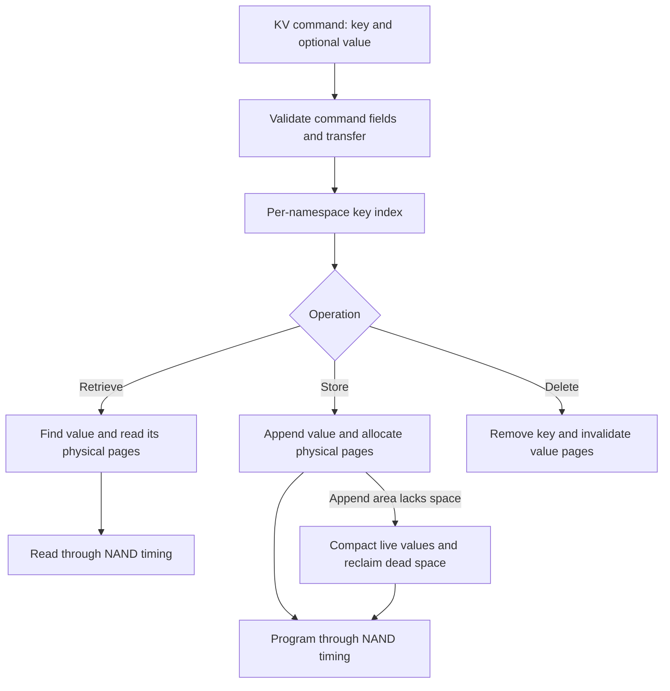

# Key-value

:::tip[Design note]

This page traces the KV-SSD implementation through the source. For launch lines, guest commands, limits and verification, use the [KV-SSD guide in the FEMU Manual](/manual/modes/kvssd).

:::

import DesignFigure from '@site/src/components/DesignFigure';

`femu_mode=5` exposes a key-value command set with Store, Retrieve, List, Delete,
and Exist handlers. Each KV namespace has its own key index and value store.
Use [kv.conf](/configs/kv.conf) and drive the controller through passthrough.
An ordinary block-device benchmark does not exercise these operations.

## Internal design

<DesignFigure src="/img/manual/mode-kv.svg"
  alt="KV-SSD: each KV namespace keeps a hash index and a value arena, and a private black-box model places the value pages"
  caption="From the FEMU Manual. Each key maps to both a byte range in the value arena and the pages a private BBSSD model placed. Updates and compaction maintain both representations under the namespace mutex." />



The implementation uses an index over keys and a log-append value area, with
separate physical-page tracking. Compaction moves live values when reclaimable
space is needed. Media reads and programs contribute timing; namespace state
is protected by a mutex. This is its own KV path, not ordinary black-box
`mapping=hybrid` or `gc_policy` applied to opaque values.

Keys are at most 16 bytes in the implemented wire format. The default maximum
value is 2 MiB, subject to command transfer validation. Store supports
store-if-key-exists and store-if-no-key-exists. Retrieve can return a shorter
buffer while reporting the full value length in the completion result.

### Store, overwrite, and deletion

`kvssd_ftl_store()` checks conditional-store flags, the key limit, and logical
capacity before reserving value space. Logical occupancy counts live key bytes
plus live value bytes and subtracts the replaced entry when checking an update.
The append frontier separately determines whether a contiguous value fits.

After reserving space, Store copies guest bytes into the arena and programs new
modeled pages. It then publishes the index entry and invalidates the replaced
page list. An overwrite leaves the old byte range reclaimable. Delete removes
the index entry, invalidates its pages, and updates occupancy; it does not move
the remaining values immediately.

| Operation | Value bytes and index | Modeled media work |
| --- | --- | --- |
| Store or overwrite | Append bytes, then publish offset, length, and page list | Program new value pages; invalidate replaced pages |
| Retrieve | Copy `min(value length, host buffer size)` bytes; report full length | Read only pages touched by the transferred span |
| Delete | Remove key and mark its old byte range reclaimable | Invalidate old pages and charge command/index costs |
| Compaction | Pack live values in old-offset order and rewrite offsets | Program replacement pages as `GC_IO`, then invalidate old lists |

### When compaction runs

`kv_value_alloc()` first tries the unused tail of the arena. If the new value
does not fit and reclaimable bytes exist, it calls `kv_compact()` while holding
the namespace lock. Compaction gathers live entries, checks physical-page
availability, and sorts by old byte offset so values can move downward safely.
Each entry receives a new page list; `memmove()` packs its bytes when needed.
After a successful pass, the append frontier equals the sum of live value
lengths and reclaimable bytes become zero. The pending allocation is retried.

For example, storing two 4 KiB values, overwriting the first, and deleting the
second leaves one live 4 KiB value and 8 KiB of reclaimable arena space. Those
operations alone do not trigger compaction while the tail still has room.
Apply enough further allocation pressure to reach the compaction branch before
comparing reclamation costs. A capacity error can also reflect unavailable
physical pages or a failed allocation during compaction, so live-byte occupancy
alone does not explain every failure.

Compaction programs all live entries, including an entry whose byte offset is
already at the new frontier. Count modeled GC writes separately from bytes
actually moved by `memmove()`. Ordinary black-box `gc_policy` is not the selector
for this value-arena compaction path.

## Configure and exercise

```text
-device femu,femu_mode=5,devsz_mb=4096,namespaces=1
```

The download makes the shared geometry explicit. FDP plus KV is refused because
FDP's reclaim-unit allocation conflicts with the KV write path. Geometry
validation applies, but KV handles capacity and reclamation through its own
implementation.

Copy `hw/femu/scripts/kv-probe.c` from the FEMU source into the Linux guest.
Use a dedicated test controller with KV namespace ID **1**: the probe hard-codes
that namespace ID, whichever node is supplied. It stores and deletes the key
`hello`, so an existing value under that key is not preserved.

Compile successfully before invoking the probe:

```bash
gcc -O2 -o kv-probe kv-probe.c && sudo ./kv-probe /dev/nvme0
```

The probe takes the node as its argument (default `/dev/nvme0`) and uses the
32-bit I/O passthrough ioctl, which works on the controller node and on the
generic node `/dev/ngXnY` that Linux 6.0 and later create for a KV namespace.
The controller node refuses I/O passthrough when the controller has more than
one namespace; the [KV-SSD guide](/manual/modes/kvssd) gives the kernel
requirement and which node to use. The probe tests Store, Exist, full and
short Retrieve, conditional-store behavior, deletion, and missing-key status. Inspect its output for both command status and payload
checks. Success ends with `KVPROBE_DONE fails=0` and exit status 0. A failed
check yields status 1; failure to open the controller yields status 2. Capture
the exit status immediately after running the command, and retain failed output.
The probe continues after individual failed checks, so failure does not imply
that it left the key unchanged.

The probe also checks rejection of a key longer than 16 bytes. It does not
exercise List, multiple namespaces, compaction under capacity pressure, or
persistence across emulator restarts. For guest-tested Store, Retrieve, Exist,
List and Delete commands with captured output, follow
[tutorial 07](/manual/tutorials/07-kv). Do not expect `/dev/nvme0n1` to appear:
Linux attaches no block device to a KV namespace.

For measurements, report key count, key/value sizes, update ratio, occupancy,
and compaction activity. Distinguish index cost, payload-copy work, and modeled
NAND timing; a functional command-set implementation is not a performance
calibration for a commercial KV SSD.

## Implementation sources

Reviewed against FEMU [`39a55eeb637b`](https://github.com/MoatLab/FEMU/tree/39a55eeb637b23c26b3a2ce9254399c9e0b1b3be). The examples describe this revision; see [validation coverage](/docs/implementation#validation-coverage).

- [kvssd/kvssd.c](https://github.com/MoatLab/FEMU/blob/39a55eeb637b23c26b3a2ce9254399c9e0b1b3be/hw/femu/kvssd/kvssd.c): wire decoding and command dispatch
- [kvssd/kvssd-ftl.c](https://github.com/MoatLab/FEMU/blob/39a55eeb637b23c26b3a2ce9254399c9e0b1b3be/hw/femu/kvssd/kvssd-ftl.c): index, value append, physical pages, and compaction
- [kvssd/kvssd-admin.c](https://github.com/MoatLab/FEMU/blob/39a55eeb637b23c26b3a2ce9254399c9e0b1b3be/hw/femu/kvssd/kvssd-admin.c): KV Identify data
- [scripts/kv-probe.c](https://github.com/MoatLab/FEMU/blob/39a55eeb637b23c26b3a2ce9254399c9e0b1b3be/hw/femu/scripts/kv-probe.c): guest command and payload checks
