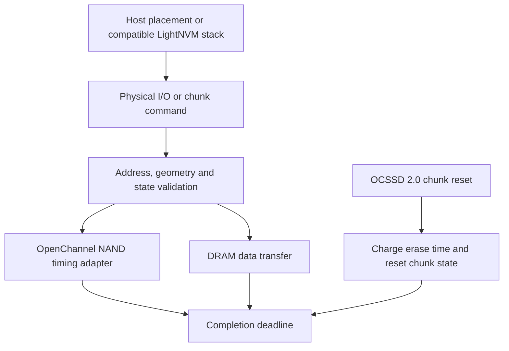

# OpenChannel

:::tip[Design note]

This page traces the OpenChannel implementation through the source. For launch lines, guest commands, limits and verification, use the [OpenChannel guide in the FEMU Manual](/manual/modes/ocssd).

:::

`femu_mode=0` exposes the historical OpenChannel interfaces. `lver=1` selects
OCSSD 1.2 and `lver=2` selects OCSSD 2.0. The host manages physical placement
through the interface rather than issuing only ordinary logical block writes.

Use [openchannel.conf](/configs/openchannel.conf) for a single OCSSD 2.0 device.
The geometry uses `lsec_size`, `lsecs_per_pg`, `lpgs_per_blk`, `lnum_ch`,
`lnum_lun`, and `lnum_pln`, rather than the ordinary black-box property names.
`flash_type` selects the cell type for the built-in timing tables: 1 (SLC),
2 (MLC), 3 (TLC) or 4 (QLC); any other value fails realize. On OCSSD 1.2,
`oc12_channel_timing` also charges channel transfer time per page accessed.
The vendor admin command 0xEE rewrites the read, program, erase and channel
times of an OpenChannel controller and is refused on any other mode. The
[OpenChannel guide](/manual/modes/ocssd) lists the timing tables and the
command's fields.

OpenChannel is a controller-level mode. A mixed `namespace_modes` configuration
cannot insert it into a controller of another mode, and more than one
OpenChannel namespace is refused. Keep the historical guest/driver environment
with the experiment or use a client that implements the command interface:
Linux removed LightNVM in 5.15, so a kernel-driven experiment needs a guest
kernel older than 5.15, and a newer guest must drive the device from user
space, for example with SPDK.

The two versions have different address and command structures. OCSSD 2.0
tracks chunks and reset operations; at this revision a chunk reset charges
its erase cost. Do not treat reset as free because it also clears metadata.
Ordinary black-box GC policy selectors do not substitute for host-side
OpenChannel placement and reclamation.

Verify Identify geometry, physical read/write, chunk state, and reset behavior
with a matching host stack before collecting performance data. Preserve that
stack's revision alongside the FEMU commit, because compatibility is part of
reproducing an OpenChannel experiment.

## Implementation sources

Reviewed against FEMU [`39a55eeb637b`](https://github.com/MoatLab/FEMU/tree/39a55eeb637b23c26b3a2ce9254399c9e0b1b3be). The examples describe this revision; see [validation coverage](/docs/implementation#validation-coverage).

- [ocssd/oc12.c](https://github.com/MoatLab/FEMU/blob/39a55eeb637b23c26b3a2ce9254399c9e0b1b3be/hw/femu/ocssd/oc12.c): OCSSD 1.2 command implementation
- [ocssd/oc20.c](https://github.com/MoatLab/FEMU/blob/39a55eeb637b23c26b3a2ce9254399c9e0b1b3be/hw/femu/ocssd/oc20.c): OCSSD 2.0 chunk, I/O and reset behavior
- [nvme-admin.c](https://github.com/MoatLab/FEMU/blob/39a55eeb637b23c26b3a2ce9254399c9e0b1b3be/hw/femu/nvme-admin.c): vendor admin command 0xEE
- [femu.c](https://github.com/MoatLab/FEMU/blob/39a55eeb637b23c26b3a2ce9254399c9e0b1b3be/hw/femu/femu.c): version and `flash_type` checks and the single-namespace constraint
