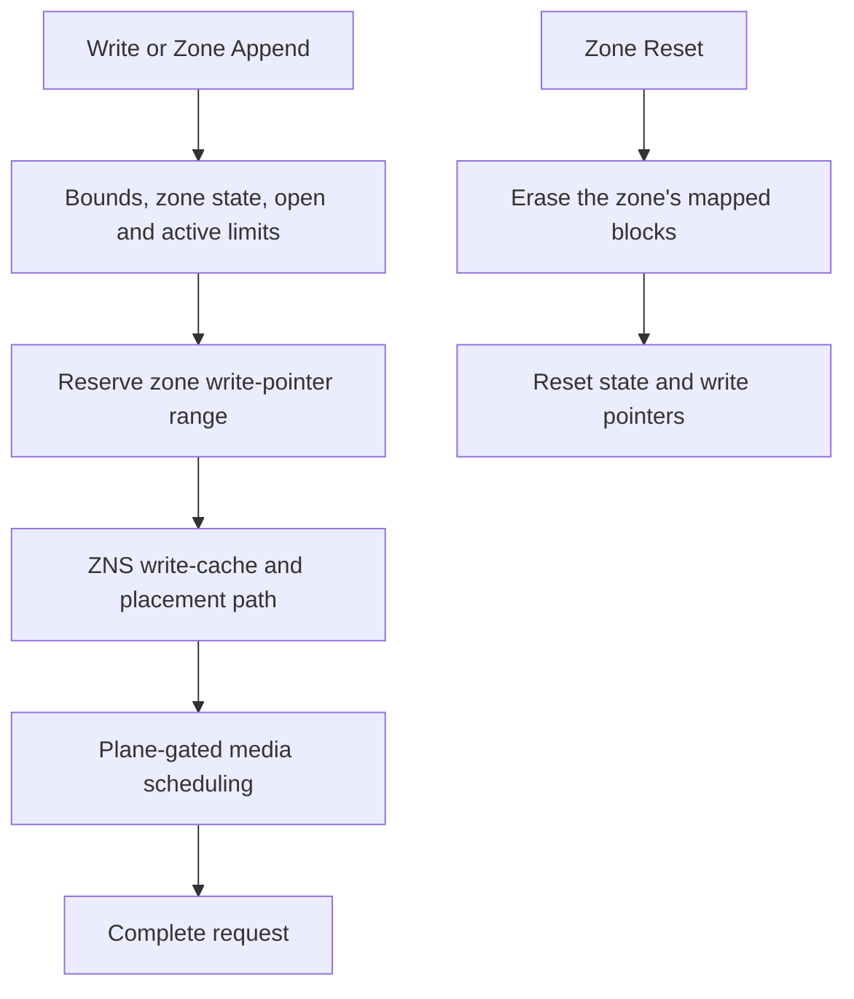

# Zoned namespaces

:::tip[Design note]

This page traces the ZNS implementation through the source. For launch lines, guest commands, limits and verification, use the [ZNS guide in the FEMU Manual](/manual/modes/zns).

:::

import DesignFigure from '@site/src/components/DesignFigure';

`femu_mode=3` exposes sequential-write zones. The host manages placement and
zone lifetimes; FEMU validates zone state, advances write pointers, and models
reads, programs, and resets. Start with [zns.conf](/configs/zns.conf).

## Command and media paths

<DesignFigure src="/img/manual/zns-states.svg"
  alt="ZNS zone state machine: Empty, implicitly and explicitly opened, Closed, Full, and the fault-only Read Only and Offline states"
  caption="Figure 1, from the FEMU Manual. Zone state and resource ownership are related but distinct: the open limit counts opened zones, the active limit counts opened and closed ones, so closing a zone frees an open slot without freeing its active slot." />

```mermaid
stateDiagram-v2
  accTitle: Zone state transitions
  accDescr: Writes and management commands move zones among empty, open, closed, and full states. Implicit and explicit open are grouped together; read-only and offline cases are described separately in the text.
  [*] --> Empty
  Empty --> Open: write or open
  Open --> Closed: close
  Closed --> Open: reopen or write
  Open --> Full: finish or reach capacity
  Closed --> Full: finish
  Full --> Empty: reset
  Closed --> Empty: reset
  Open --> Empty: reset
```





The state diagram groups implicit and explicit open into one state. The command
handler also distinguishes conventional, read-only, and offline cases. A
normal sequential zone only accepts writes at its write pointer; Zone Append
chooses the current pointer and returns the chosen position.

### Read the state machine against the implementation

| Operation | Function | State and resource consequence |
| --- | --- | --- |
| Explicit Open | `zns_open_zone()` | An Empty zone first passes the active-limit check; at the open limit an implicitly open zone is then closed to make room; Empty acquires active then open capacity, and failure to acquire open capacity rolls back the newly acquired active slot |
| Close | `zns_close_zone()` | Implicitly or explicitly open becomes Closed; an already Closed zone succeeds without acquiring resources |
| Finish | `zns_finish_zone()` | Empty, Open, or Closed becomes Full; Open and Closed release the resources they hold |
| Reset | `zns_reset_zone()` | Empty is already reset; Open, Closed, and Full enter reset processing; other states reject this transition |
| Write-driven opening | `zns_auto_open_zone()` | An Empty target first passes the active-limit check; the path may then close an implicitly open zone before checking the open limit |

This order matters when debugging limits. An explicit Open failure from Empty
does not consume an active slot. Both paths check an Empty target's active
limit before closing anything, so a command refused for the active limit
leaves other zones as they were. A command that succeeds at the open limit may
still have closed another, implicitly open zone. Report all affected zones,
not only the target zone, when investigating that sequence.

## Geometry differs from black-box geometry

ZNS uses `zns_num_ch`, `zns_num_lun`, `zns_num_plane`, and `zns_num_blk`, with
an internal 16 KiB NAND page. At this revision:

```text
pages_per_block = namespace_bytes / 16384
                  / (zns_num_ch × zns_num_lun × zns_num_blk)
zone_bytes = channels_per_zone × zns_num_lun × zns_num_plane
             × pages_per_block × 16384
```

Integer divisions truncate. `zns_chnls_per_zone=0` uses all channels; a positive
value must divide the channel count. The 4 GiB recipe produces 256 MiB zones
and 16 zones. These formulas follow the current implementation, including its
plane factor; do not substitute the black-box capacity calculator.

## Resource and timing controls

| Property | Unit and meaning |
| --- | --- |
| `zns_max_active`, `zns_max_open` | Zone counts; zero means unlimited |
| `zns_zone_cap` | Writable bytes per zone; zero uses full zone size |
| `zns_num_conv_zones` | Leading zones treated as conventional/random-write |
| `zns_zd_ext_size` | Descriptor-extension bytes, validated by the handler |
| `zns_chnls_per_zone` | Channel width of one zone |
| `zns_cross_zone_read` | Whether reads may span zone boundaries |
| `zns_zasl_bs` | Maximum append transfer bytes; zero falls back to MDTS |
| `zns_flash_type` | Numeric cell type; default QLC |
| `zns_pg_rd_lat`, `zns_pg_wr_lat`, `zns_blk_er_lat` | Array-time overrides in ns |
| `zns_cmd_addr_lat`, `zns_pg_xfer_lat`, `zns_status_lat` | Optional channel phases in ns |
| `zns_pe_suspend`, `zns_tsusp_ns` | Read preemption of program/erase and overhead |

The shared media adapter gates on a **plane**. It keeps channel accounting off
until a bus phase is set. SLC, TLC, and QLC have built-in values; MLC and PLC
require explicit read, program, and erase times. Zone reset charges erase time
rather than treating state reset as a free operation.

## Distinguish open and active limits

An open zone holds both an open and an active resource. Closing it releases
only the open resource. Finishing or resetting it releases its active resource
as well. A closed zone therefore still counts toward `zns_max_active`.

For a focused experiment, copy [zns.conf](/configs/zns.conf) and change the
`[zones]` section to `zns_max_open = 1` and `zns_max_active = 2`. Keep the
remaining geometry unchanged. Start a fresh emulator and select three empty
sequential zones, A, B, and C, from Report Zones. Use their reported start LBAs,
not byte offsets, for individual zone-management commands. Keep other traffic
off this expendable namespace and leave ZRWA disabled.

Issue explicit Open, Close, and Finish commands in this order. Report zones
after every command and save its completion status:

| Command | Expected result | Open / active resources after command |
| --- | --- | --- |
| Open A | A becomes explicitly open | 1 / 1 |
| Open B | Too many open zones; B stays empty | 1 / 1 |
| Close A | A becomes closed | 0 / 1 |
| Open B | B becomes explicitly open | 1 / 2 |
| Close B | B becomes closed | 0 / 2 |
| Open C | Too many active zones; C stays empty | 0 / 2 |
| Finish A | A becomes full, without filling it with host data | 0 / 1 |
| Open C | C becomes explicitly open | 1 / 2 |

Counts in the table follow the implementation's resource accounting. Use zone
states to check them; these are not additional fields promised in Report Zones.
Finish advances the write pointer to the writable boundary. Reset returns the
zone to empty and is required before reusing a finished zone. Closing alone
does not rewind its write pointer or reclaim its active resource.

Do not replace the explicit Open commands with writes in this test. A write
opens a zone implicitly, and at the open limit both `zns_auto_open_zone()` and
`zns_open_zone()` close an implicitly open zone to make room, so with writes
the second Open B would succeed. Explicitly opened zones are never closed this
way. Resource failures carry the do-not-retry bit. These expected results were
traced in the source; for a guest-tested walk through zone states, append and
the open limit, follow [tutorial 03](/manual/tutorials/03-zns).

## Zone Random Write Area

Enable ZRWA by setting all three properties together:
`zns_zrwa_size`, `zns_zrwafg_size`, and `zns_zrwa_num`. The first two are counts
of logical blocks; the last is the number of available ZRWA resources. Size
and zone capacity must both be divisible by flush granularity, and the Identify
field limits apply.

The host allocates a ZRWA to a zone through zone-management commands. Writes
can then be out of order within the permitted moving window, with explicit or
implicit flush advancing it. Allocation is finite and released by the relevant
zone transitions. This feature does not remove ordinary sequential-zone rules
from zones that have no allocated ZRWA.

## Injected write faults

Set `err_write_fail_ppm=1000` on the ZNS device to inject a fault on every
1000th write reaching the injection point. The counter is per zoned namespace,
not per zone. The period uses integer division, as described under
[error injection](/docs/policies#error-injection). The black-box read-error
property does not enable a corresponding ZNS read injection path.

Injection occurs after payload transfer and zoned-write finalization. The
affected zone becomes read-only, releases its open and active resources,
and enters the Changed Zone List. The failing request returns
`NVME_WRITE_FAULT` with the do-not-retry bit; later writes are rejected by the
zone state machine. Failure status therefore does not imply an unchanged
payload or write pointer.

For a short validation run, use `err_write_fail_ppm=500000` to select every
second eligible write. Start a fresh namespace, submit two valid sequential
writes, and inspect completion status, the zone report, and Changed Zone List.
Check that a subsequent write to the affected zone is rejected. Keep unrelated
traffic off the namespace because it advances the same counter. This is a
source-derived procedure; the [ZNS guide](/manual/modes/zns) describes the
Changed Zone List and its notice.

## Verification

```bash
sudo nvme id-ns /dev/nvme0n1
sudo nvme zns id-ns /dev/nvme0n1
sudo nvme zns report-zones /dev/nvme0n1
```

Confirm zone size, capacity, count, limits, and write pointers. On an expendable
namespace, exercise sequential writes, append, close, finish, and reset; report
zones after each transition. Compare mismatched writes and resource exhaustion
with the expected error status before running a filesystem or placement study.

## Implementation sources

Reviewed against FEMU [`39a55eeb637b`](https://github.com/MoatLab/FEMU/tree/39a55eeb637b23c26b3a2ce9254399c9e0b1b3be). The examples describe this revision; see [validation coverage](/docs/implementation#validation-coverage).

- [zns/zns.c](https://github.com/MoatLab/FEMU/blob/39a55eeb637b23c26b3a2ce9254399c9e0b1b3be/hw/femu/zns/zns.c): geometry, zone states, ZRWA, and command validation
- [zns/zftl.c](https://github.com/MoatLab/FEMU/blob/39a55eeb637b23c26b3a2ce9254399c9e0b1b3be/hw/femu/zns/zftl.c): per-zone placement, media timing and reset
- [femu.c](https://github.com/MoatLab/FEMU/blob/39a55eeb637b23c26b3a2ce9254399c9e0b1b3be/hw/femu/femu.c): ZNS property defaults
