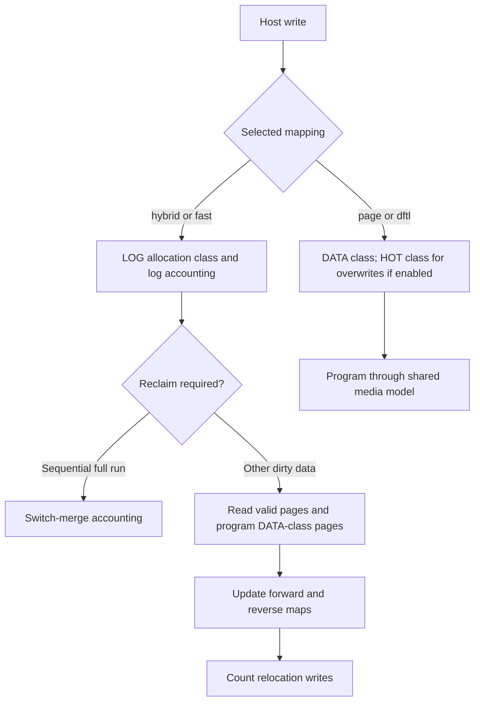
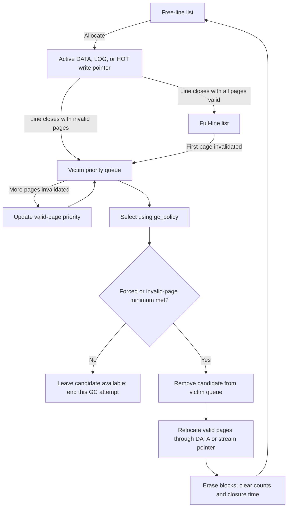
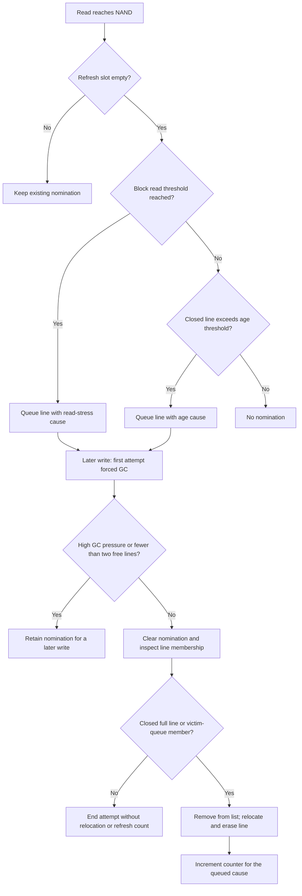
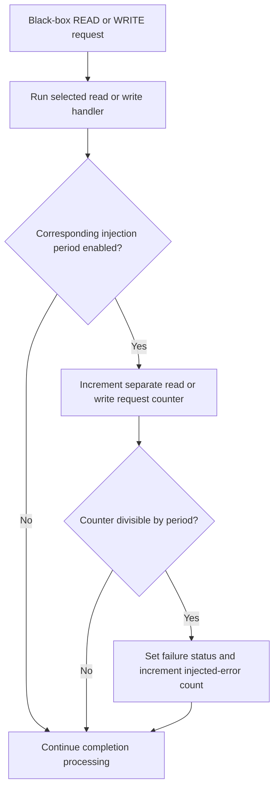

# Mapping, GC, and cache policies

import DesignFigure from '@site/src/components/DesignFigure';

Choose policies according to the execution path you want to study. These
selectors are not interchangeable: `mapping` chooses translation behavior,
`gc_policy` chooses an ordinary black-box victim line, `gc_strategy` chooses
an FDP reclaim-unit strategy, and `cache_evict` chooses a read-cache victim.
The [recipes](/docs/configuration-recipes) provide complete configurations.

## Mapping schemes

| `mapping` | Behavior | Configuration and limits |
| --- | --- | --- |
| `page` (default) | Direct lookup in the full logical-to-physical table | No translation-cache cost; `mapping_cache_mb` alone does not enable DFTL |
| `dftl` | Same correct mapping table plus a demand-cached translation cost model | `mapping_cache_mb` sets MiB; naming DFTL with size 0 selects 4 MiB |
| `hybrid` | Per-logical-block log tracking, sequential switch merges, and full merges | Fixed pool of 16 log records; full merges relocate valid pages into DATA-class allocations |
| `fast` | Sequential-write tracking plus a shared random-write log pool | Pool budget is 16 blocks; a random reclaim pass processes at most two dirty logical blocks |

DFTL uses CLOCK eviction of translation pages. A miss charges a translation-page
read; evicting a dirty entry also charges a writeback on that entry's home LUN.
The home LUN is selected from the translation-page index. The full table remains
allocated, so this models translation traffic rather than reducing FEMU's host
memory to a physical DFTL controller's RAM budget.

In `ssd_read` and `ssd_write`, translation and data costs are accumulated through
maximum latency and shared availability clocks. They are not unconditionally
summed as a strict translation-then-data dependency. Base GC, TRIM, and FDP
mapping changes do not each incur a CMT access. Account for these boundaries
when interpreting a DFTL experiment.

### DFTL cache coverage and eviction

One translation entry occupies eight modeled bytes. At 4 KiB per NAND page,
one translation page covers 512 logical pages, or a 2 MiB logical-address range.
The [4 MiB DFTL recipe](/configs/dftl.conf) holds 1,024 translation pages,
covering up to 2 GiB of logical pages at once. Its 4 GiB exposed namespace can
therefore exceed translation-cache coverage. Count distinct translation pages
in the working set, not just the number of data pages touched.

<DesignFigure src="/img/manual/ftl-mapping.svg"
  alt="The four black-box mapping schemes: full page table, DFTL map-page cache, BAST log per block, and FAST shared log pool"
  caption="From the FEMU Manual. Panel (b) is DFTL: a hit is answered from the cached map pages; a miss reads a map page from NAND, and a dirty victim is programmed first. The code serializes that writeback and read." />

For a two-slot illustration, read LPN 0, write LPN 511, read LPN 512, then read
LPN 1024. The first two accesses share translation page 0: the write hits and
marks it dirty. The next read installs translation page 1. On the final miss,
CLOCK clears both reference bits and selects page 0 for writeback before
reading page 2. With four LUNs arranged as two channels of two LUNs, those
operations target channel 0/LUN 0 and channel 1/LUN 0 respectively. The code
serializes this writeback/read pair even though their home LUNs differ.

The two-slot case isolates the eviction rule; it is not the recipe's capacity.
The subsequent data operation uses the datapath's shared timing clocks and
maximum-latency accumulation described above. A translation-cache hit does
not imply a read-cache hit, and a read-cache hit can follow a translation miss.

### Hybrid and FAST allocation

Hybrid and FAST use separate LOG and DATA allocation classes. Their full merges
update physical mappings and add relocation writes to WAF. Switch merges follow
a simplified accounting path that charges one erase at the logical block's
retained data-block anchor. Neither overwrites nor trim release a hybrid log
slot or remove that anchor; only a merge does. Hybrid checks for a merge after
every page it programs, while FAST merges once per write request or destage
batch. These are FEMU's implemented variants; their names do not imply every
mechanism from a published algorithm. Pool sizes and FAST's two-block drain
limit are source constants, not runtime properties. Hybrid's switch merges,
full merges and merge erases appear in the
[vendor log](/docs/observability) at offsets 88, 96 and 104.



## Ordinary garbage collection

`gc_policy` defaults to `greedy`. Unknown policy names are rejected at
initialization. Victims are closed lines with invalid pages.

| Value | Selection rule | Cost of selecting a victim |
| --- | --- | --- |
| `greedy` | Fewest valid pages | Pop the valid-page priority queue |
| `random` | Random victim from the queue | Random queue selection |
| `cost-benefit` | Highest age × invalid pages / valid pages; fully invalid wins | Scan candidates; age is time since line closure |
| `fifo` | Earliest line closure | Scan candidates by `close_time` |
| `d-choice` | Fewest valid pages among four sampled candidates | Four clock-derived samples; this is not a user-seeded experiment |

For background GC, the selected victim must have at least
`floor(pages_per_line / 8)` invalid pages. Forced GC bypasses that minimum. Background pressure is
checked after request processing; the write path performs forced collection
when free lines cross the high threshold. There is no independent background
GC worker in this path.

Selection happens **before** this invalid-page check. If the chosen candidate
fails it, the call returns without trying another candidate. Random selection
reinserts its rejected candidate. FIFO, cost-benefit, and d-choice can therefore
skip a background pass even when another line meets the minimum. D-choice's
four samples can repeat a candidate; they are not four guaranteed distinct
lines. Record free-space pressure as well as WAF when comparing these policies.

The threshold properties express **used-space percentages**, converted into
free-line counts:

```text
background free-line threshold = floor((1 - gc_thres_pcent / 100) × total_lines)
forced free-line threshold     = floor((1 - gc_thres_pcent_high / 100) × total_lines)
```

Defaults are 75 and 95. Both must be within 1 through 100, and the forced
percentage must not be smaller than the background percentage. At 256 lines,
the default thresholds are 64 and 12 free lines. With `hot_cold_sep`, Streams,
or a `hybrid` or `fast` mapping, the forced threshold is at least one line.

Collection reads and relocates valid pages, updates mappings, and erases the
victim's blocks. Black-box line GC groups erases across planes in each LUN.
With GC delay enabled, these operations occupy media timelines and affect
subsequent requests. GC delay is enabled at initialization. The vendor command
that disables it removes these timing charges, not relocation, erase
bookkeeping, or GC-write counting. Keep this runtime setting identical between
comparison runs; it is separate from `gc_policy`.

### Worked example: the same lines, different victims

<div className="gc-selector-example compact-table">

Consider three closed victim lines with **128 pages per line**, observed at a
fixed clock of **1,000 ns**. These are controlled selector-test inputs. They
illustrate ranking rather than the state produced by a particular guest workload.
Valid and invalid counts are pages; age is time since closure. The cost-benefit
rank is `age × invalid / valid`.

| Line | Valid | Invalid | Age (ns) | Rank |
| --- | ---: | ---: | ---: | ---: |
| A | 80 | 48 | 100 | 60 |
| B | 32 | 96 | 10 | 30 |
| C | 64 | 64 | 900 | 900 |

All three meet the background minimum of `128 / 8 = 16` invalid pages.
**Greedy selects B**, which has the fewest valid pages to move. **FIFO selects
C**, which closed first. **Cost-benefit also selects C**: its greater age
outweighs B's lower valid-page count. Random and d-choice depend on their
selection or samples; their names do not imply one of these deterministic
rankings. A fully invalid line receives priority in cost-benefit without
dividing by zero.

Now consider a different two-line queue:

| Line | Valid | Invalid | Age (ns) |
| --- | ---: | ---: | ---: |
| Older | 113 | 15 | 1,000 |
| Newer | 112 | 16 | 1 |

Older fails the 16-invalid-page minimum; Newer meets it.
FIFO prefers Older. Cost-benefit does too: its rank is about 132.74 versus
0.14 for Newer. Both reject Older during background qualification and return
without collecting Newer. Forced selection bypasses the minimum. This is why
an eligible line somewhere in the queue does not guarantee a background
collection under every policy.

The isolated [selector checks](/docs/implementation#validation-coverage) execute
these ranking and rejection cases against the selector callbacks. For a workload
comparison, use the [GC configuration recipe](/docs/configuration-recipes#policy-experiments)
and record whether selection and collection actually occurred.

</div>

### Line lifecycle and policy boundary

<DesignFigure src="/img/manual/ftl-gc.svg"
  alt="Black-box line states and garbage collection, from free line through written, full and victim sets, with background and foreground GC and each gc_policy"
  caption="Figure 1, from the FEMU Manual. Victim selection is one stage of line GC. Qualification, relocation, and optional timing charges determine what the selected policy actually exercises." />



The diagram describes ordinary line GC with space available for relocation.
Every valid page is moved before any block of the victim is erased. If a page
has nowhere to go, the line returns to the victim queue (or the full-line list)
with its remaining pages intact and the GC attempt ends without an erase.
An active line is outside the victim queue, even after overwrites invalidate
some of its pages. A closed, entirely valid line becomes eligible only after
invalidation. Refresh uses a separate entry path that can reclaim an entirely
valid closed line. LOG and HOT classes have their own write pointers, but
ordinary GC relocations use the DATA pointer; with Streams, pages from a
stream-tagged line move through a write pointer for that stream instead. If a
class cannot acquire a line, the allocator falls back to DATA, so class
selection is not a guarantee of physical isolation under exhaustion.

## Capacity and placement

The geometry gives raw NAND bytes:

```text
raw = secsz × secs_per_pg × pgs_per_blk × blks_per_pl
      × pls_per_lun × luns_per_ch × nchs
```

`devsz_mb` specifies exposed capacity in MiB when explicit over-provisioning is
off. It need not equal raw capacity and normally must be smaller to leave room
for GC. With black-box `op_pcent=P`, the controller instead derives exposed
capacity as `raw × 100 / (100 + P)`, split across namespaces and sector-aligned.
Thus `op_pcent=10` exposes about 90.91% of raw capacity, not 90%.

Capacity validation reserves the forced-GC free-line threshold plus one DATA
write-pointer line, another for `hot_cold_sep`, another for log-class mapping
(`hybrid` or `fast`), and `streams.max + 1` with Streams. With any of those
three options, the forced-GC threshold is at least one line even where the
percentage rounds to zero, which happens below 20 lines at the default 95%.
The namespace is rounded up to whole pages before the comparison, so a
partially exposed last page counts. Exposing the entire array can therefore
fail at realization even when the geometry product equals `devsz_mb`. The
[geometry calculator](/docs/geometry) checks only the plain page-mapped case;
the manual's [reserve section](/manual/design/ftl#the-reserve) covers the rest.

`hot_cold_sep=on` directs overwrites to a HOT allocation class in page/DFTL
mapping. The classification is simply whether the LPN is already mapped; it is
not a frequency estimator. FDP rejects this property.

## FDP collection strategies

FDP has a separate reclaim-unit path. Use `gc_strategy`, not `gc_policy`:

| Value | Implemented strategy |
| --- | --- |
| `0` | Global greedy selection by valid-page count |
| `1` | Cost-benefit using utilization and time since invalidation |
| `2` | Random reclaim-unit selection |
| `4` | Per-handle pressure selection, with a global-greedy fallback |

Other values are rejected even though the header contains additional strategy
enumerations. FDP also rejects non-default named GC and mapping policies,
write buffering, hot/cold separation, and several ordinary refresh knobs.
See [FDP](/docs/modes/fdp) for the complete configuration boundary.

## Read cache

`read_cache_mb=0` disables the cache. A positive MiB value determines how many
logical pages it can remember. Hits bypass NAND read timing and occupancy;
misses install a mapped page and continue to NAND. Programming a write and
deallocation invalidate cached entries. A buffered overwrite invalidates on
destage; reads of that pending page are served from the write buffer first.
The hit latency is `max(1, pg_rd_lat / 16)` ns when the configured
flat read latency is nonzero, otherwise 1000 ns.

| `cache_evict` | Implemented behavior |
| --- | --- |
| `clock` (default) | Second-chance reference bits |
| `random` | Fixed-seed internal linear-congruential generator |
| `lru` | Exact least-recently-used selection by scanning the slot array |
| `arc` | 2Q-style probation/protection: evict the least-recent unprotected page first |

The `arc` name is retained for configuration compatibility; this implementation
does not have full ARC's adaptive ghost queues. Exact LRU and the 2Q-style policy
scan the cache, so increasing its size changes host-side work as well as the
modeled hit rate. The cache models timing and membership, not an additional
copy of payload bytes.

### Trace a cache comparison

For a two-slot cache, read mapped pages in the order **A, A, B, C**:

| Read | `lru` | `arc` (2Q-style) |
| --- | --- | --- |
| First A | Miss; insert A | Miss; insert A unprotected |
| Second A | Hit; update A's recency | Hit; protect A |
| B | Miss; insert B, now newer than A | Miss; insert B unprotected |
| C | Miss; evict A, the least recently used page | Miss; evict B, the unprotected page |

Both runs have one hit and three misses at this point, but different contents.
A following read of A distinguishes them. This is a small policy illustration;
the downloadable recipe uses a larger cache. With ordinary 4 KiB pages,
`read_cache_mb=1` holds 256 pages. Scale the working set to that capacity when
running a guest experiment.

Read-path order also affects interpretation. A write-buffer hit returns before
translation or read-cache lookup and increments `read_hit_cnt`. Otherwise DFTL
can perform translation work before mapping validation and read-cache lookup.
An unmapped page skips the read cache entirely, so reading an untouched
namespace does not warm it. Read-cache hits and misses use their own counters;
they exclude buffered and unmapped reads. Prepopulate the working set and
record buffering and mapping settings when comparing eviction policies.

## Write buffer, refresh, and error experiments

`buffer_size` is measured in **pages**, not MiB. At 4 KiB/page, 2048 pages model
8 MiB. `buffer_thres_pcent` controls the occupancy threshold for bounded writeback.
Repeated writes to a buffered LPN replace its pending program; reads can hit
that pending page. `vwc=1` advertises the volatile cache. Flush requests writeback
of all pending pages through the FTL; FUA writes bypass buffering for their own
data. Payload bytes already reside in the volatile DRAM backend. The buffer
holds logical page numbers and pending program work, not another payload copy.

### Admission and eviction example

The watermark is `max(1, floor(buffer_size × buffer_thres_pcent / 100))`.
The normal writeback batch is `max(1, buffer_size - watermark)` pages. Admission
checks the watermark **before inserting a new distinct page**. Rewriting a
page already held moves it to the most recently written end without triggering
this admission writeback. Eviction selects the least recently written page.

For `buffer_size=4,buffer_thres_pcent=75`, the watermark is three and the batch
is one. With sufficient allocation space, the following independent one-page
writes produce this sequence:

| Write | Pending pages, oldest first | Modeled program caused by this write |
| --- | --- | --- |
| A | A | None |
| B | A, B | None |
| C | A, B, C | None |
| A again | B, C, A | None; the pending A is updated |
| D | C, A, D | B is written back before D is admitted |

A later Flush attempts to program C, A, and D. Under these conditions five
host page writes become four modeled page programs, excluding GC or other
background work. Measure through that Flush when comparing complete writeback
costs. The standard 2048-page, 90% recipe instead has a watermark of 1843 pages
and a batch of 205 pages. The threshold is a percentage input, not a fraction.

### Flush, FUA, and disabling the cache

| Event | Effect on pending program work |
| --- | --- |
| Flush | Calls `ssd_buffer_destage()` with an unlimited budget, regardless of cache advertisement or enable state; with `power_loss=on` an incomplete drain fails the Flush |
| FUA write | Discards pending entries for its own pages, programs those pages directly, and leaves unrelated entries pending |
| Disable advertised VWC | Changes the feature flag; the next ordinary write takes the direct path and attempts to drain other pending entries |
| Trim | Removes pending entries for the affected pages without programming them |

Advertising no volatile cache does not by itself disable this model:
`buffer_enabled()` honors the host's disable flag only when VWC is advertised.
The Set Features handler changes the flag with the dataplane paused. It writes
back the buffers itself only with `power_loss=on`; otherwise the next ordinary
write drains them.

:::caution Exhaustion boundary
An unlimited budget does not guarantee a complete drain. Destage checks for
free lines before and after its forced GC, and before it takes a page out of
the buffer, so a page is never removed without being programmed; it stops when
`ssd_out_of_lines()` reports exhaustion. Without `power_loss`, the Flush branch
does not check remaining occupancy or set an error for an incomplete pass.
With `power_loss=on`, a Flush that leaves pages buffered completes with
Capacity Exceeded. A buffered write that cannot destage anything at the
watermark also fails with Capacity Exceeded. For capacity-pressure
experiments, inspect pending state and media-program counters rather than
treating Flush completion alone as proof of full writeback.
:::

Neither Flush nor FUA makes the DRAM payload survive emulator exit. With
`power_loss=on`, FEMU keeps an undo record for each buffered page and the
`simulate-power-loss` QOM property restores the pre-write bytes of every page
still buffered; see [power loss](/manual/design/ftl#power-loss) in the manual.

### Refresh triggers

A read can queue one line for refresh after `read_reclaim_limit` block reads or
`retention_limit_sec` since line closure. A later write attempts the relocation
when free space permits. A read-only run does not itself execute the queued
refresh, and untouched old data is not scanned by a timer.

### Refresh admission and execution

Read-stress checks run before age checks. If both thresholds are met on the
same read, the queued cause is read stress. An occupied queue prevents other
lines from being nominated. The read count belongs to a physical block; the
relocation unit is the entire line containing that block.



An active line may reach the read threshold, but it cannot be relocated by
this path. When the space checks pass, its nomination is cleared without a
refresh; another NAND read must nominate it again. A low-space return retains
the nomination instead. Age eligibility requires a nonzero line closure time,
so merely waiting after a small write does not guarantee an age refresh.

For a controlled experiment, write enough data to close lines, use reads that
miss both caches, then issue a write with spare lines available. Compare
`read_reclaims` and `retention_refreshes` before and after that sequence.
These count line refreshes by the selected cause, not threshold crossings.
The diagram assumes sufficient relocation capacity, as does ordinary line GC.

### Error injection

`err_read_unc_ppm` and `err_write_fail_ppm` derive an every-Nth-operation error
period from the requested rate. They are deterministic periodic injection,
not sampled physical error probabilities. A write fault is applied after the
write handler, so failure status does not guarantee that no state changed.
`nand_bad_blocks` affects reported spare capacity; it does not remove physical
blocks from the allocator.

For a nonzero rate, the period is `max(1, floor(1000000 / ppm))`.
For example, 1000 injects every 1000th request; 600000 injects every request
because integer division yields one. Zero disables injection. Read and write
counters are separate and start at zero during FTL initialization.

The black-box dispatcher counts READ and WRITE requests that reach these
branches, including cache hits and buffered writes. Request size does not
multiply the count. Flush, Write Zeroes, Copy, GC relocation, and destage do
not advance these injection counters. Reads return `NVME_UNRECOVERED_READ` with
the do-not-retry bit; writes return `NVME_WRITE_FAULT`.



Keep request size, splitting, retries, and prior traffic identical when
comparing runs. A cache hit can receive an injected read error, so these
counters are not a measure of NAND bit errors. ZNS uses the same write-rate
property but also transitions the affected zone to read-only; see
[ZNS fault behavior](/docs/modes/zns#injected-write-faults).

## Combining policies in an experiment

Use the [read and write diagrams](/docs/architecture#read-path) to distinguish
configuration compatibility from the work that actually reaches each policy.

| Combination | What executes | Experimental consequence |
| --- | --- | --- |
| DFTL and read cache | Translation-cache touch precedes the data-cache lookup | A data-cache hit can still incur translation traffic; compare with page mapping under the same cache workload |
| DFTL and write buffer | Buffered read hits skip translation; writes touch translation on destage | Include Flush when measuring deferred translation and programming costs |
| Hybrid/FAST and write buffer | Repeated pending writes collapse before placement and merge accounting | Compare both unique-page and repeated-page writes; buffering changes the update stream seen by the mapping policy |
| Read cache and refresh | Cache hits skip the NAND read and subsequent refresh-trigger checks | Use a controlled miss workload when testing read-stress or age-triggered refresh |
| Write buffer and GC | Forced-GC checks precede buffered admission and recur during destage | Buffering does not isolate a request from low-free-space conditions |
| FUA and write buffer | Requested pages program directly; unrelated pending pages remain | Measure FUA and Flush separately rather than treating them as equivalent drains |

Change one selector at a time, then test combinations explicitly. Record the
complete configuration and report host-write and NAND-write counter deltas
over the same interval. For buffered runs, state whether the interval ends
before or after Flush; pending programs affect the observed WAF.

## Implementation sources

Reviewed against FEMU [`39a55eeb6`](https://github.com/MoatLab/FEMU/tree/39a55eeb637b23c26b3a2ce9254399c9e0b1b3be). The examples describe this revision; see [validation coverage](/docs/implementation#validation-coverage).

- [bbssd/ftl-map.c](https://github.com/MoatLab/FEMU/blob/39a55eeb637b23c26b3a2ce9254399c9e0b1b3be/hw/femu/bbssd/ftl-map.c): mapping registry and hot/cold classification
- [bbssd/ftl-map-cmt.c](https://github.com/MoatLab/FEMU/blob/39a55eeb637b23c26b3a2ce9254399c9e0b1b3be/hw/femu/bbssd/ftl-map-cmt.c): DFTL cost model
- [bbssd/ftl-map-hybrid.c](https://github.com/MoatLab/FEMU/blob/39a55eeb637b23c26b3a2ce9254399c9e0b1b3be/hw/femu/bbssd/ftl-map-hybrid.c): hybrid log state and merges
- [bbssd/ftl-map-fast.c](https://github.com/MoatLab/FEMU/blob/39a55eeb637b23c26b3a2ce9254399c9e0b1b3be/hw/femu/bbssd/ftl-map-fast.c): FAST pool and bounded merge implementation
- [bbssd/ftl-line-gc.c](https://github.com/MoatLab/FEMU/blob/39a55eeb637b23c26b3a2ce9254399c9e0b1b3be/hw/femu/bbssd/ftl-line-gc.c): all five victim selectors and line relocation
- [bbssd/ftl-cache.c](https://github.com/MoatLab/FEMU/blob/39a55eeb637b23c26b3a2ce9254399c9e0b1b3be/hw/femu/bbssd/ftl-cache.c): read-cache policies
- [bbssd/ftl-datapath.c](https://github.com/MoatLab/FEMU/blob/39a55eeb637b23c26b3a2ce9254399c9e0b1b3be/hw/femu/bbssd/ftl-datapath.c): buffer, reads, writes, trim, refresh triggers
- [bbssd/ftl.c](https://github.com/MoatLab/FEMU/blob/39a55eeb637b23c26b3a2ce9254399c9e0b1b3be/hw/femu/bbssd/ftl.c): request dispatch and periodic error injection
- [bbssd/bb.c](https://github.com/MoatLab/FEMU/blob/39a55eeb637b23c26b3a2ce9254399c9e0b1b3be/hw/femu/bbssd/bb.c): capacity and FDP compatibility validation
- [bbssd/ftl-fdp.c](https://github.com/MoatLab/FEMU/blob/39a55eeb637b23c26b3a2ce9254399c9e0b1b3be/hw/femu/bbssd/ftl-fdp.c): FDP victim selection
