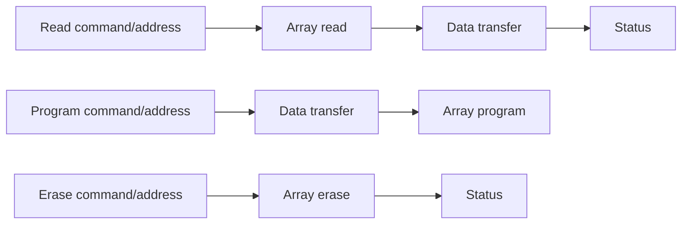

# NAND and controller timing

import DesignFigure from '@site/src/components/DesignFigure';

FEMU computes completion deadlines from resource-availability clocks. The
shared `NandMedia` layer accepts a normalized location and an operation; each
mode that uses it supplies its geometry, timing values, gating policy, and
accessors to its availability state. The black-box FTL (and the CSD, KV and
CXL SSD modes built on it) and ZNS use this layer; OpenChannel keeps its own
timing model in `timing-model/timing.c`.

This page keeps worked examples. For the per-mode charges, every timing
property and the run-time timing commands, see the manual's
[timing model](/manual/concepts/timing-model) and
[NAND timing design](/manual/design/nand-timing).

## Array scheduling

With optional bus phases disabled, an ordinary black-box operation behaves as:

```text
start = max(request_start, LUN_available)
finish = start + operation_latency
LUN_available = finish
latency = finish - request_start
```

Different LUNs can overlap. Default black-box timing gates on the LUN, so adding
planes does not automatically create independent per-plane read/program engines.
ZNS uses a **plane gate**. OpenChannel does not go through this layer. A common
API therefore does not make the modes' concurrency models identical.

For ordinary black-box multi-page requests, the request latency is generally
the maximum of its page costs, with serialization captured in shared clocks.
There is no cycle-by-cycle NAND waveform simulation.

### Worked example: two LUNs and three reads

Consider three single-page NAND reads with `pg_rd_lat=40000` ns. The array
clocks start idle; channel phases, extra ECC cost, suspend, caches, GC, and
controller-link costs are excluded. Times below are relative to the first
read's arrival. These are calls to the media scheduler, not a claim that three
arbitrary logical addresses map to these LUNs.

| Read | LUN | Arrival | Array starts | Finishes | Returned latency |
| --- | --- | --- | --- | --- | --- |
| A | 0 | 0 µs | 0 µs | 40 µs | 40 µs |
| B | 0 | 10 µs | 40 µs | 80 µs | 70 µs |
| C | 1 | 10 µs | 10 µs | 50 µs | 40 µs |

For B, the scheduler computes `max(10, 40) + 40 = 80` µs and returns
`80 - 10 = 70` µs. For C, the other LUN is idle, so it returns only the 40 µs
array cost. A standalone check against `nand_media_op()` verified
all three latencies and finish times. This checks six arithmetic outcomes;
it does not measure guest latency or validate a workload's physical placement.

Enabling channel phases adds a second shared resource, so different LUNs can
still contend for the same channel. Enabling read-cache hits can bypass these
array operations entirely. Use the [read-path diagram](/docs/architecture#read-path)
to establish which operations reach the scheduler before comparing timings.

## Channel-bus phases

<DesignFigure src="/img/manual/nand-timing.svg"
  alt="Phases of a NAND read, program and erase, and four reads issued together showing LUN serialization, a shared channel bus and parallel channels"
  caption="Figure 1, from the FEMU Manual. With bus phases on, read C waits for LUN 0, which A holds, as B does in the worked example above; B's data-out also waits for the bus, which A's data-out holds; D, on another channel, overlaps A completely." />

Any nonzero `cmd_addr_lat`, `pg_xfer_lat`, or `status_lat` enables staged channel
scheduling for black-box mode. `ch_xfer_lat` supplies the transfer duration when
`pg_xfer_lat` is zero. All durations are nanoseconds.



The program path reserves command/address, data transfer, and array time; it
does not add the read/erase status phase. Read data-out reserves a future bus
window after array completion, allowing another operation to use the bus during
the read's array phase. Each channel holds up to 32 future reservations; beyond
that, the implementation falls back to more conservative immediate booking.

For ZNS, use `zns_cmd_addr_lat`, `zns_pg_xfer_lat`, and `zns_status_lat`. Leaving
them at zero keeps channel accounting off while preserving the plane gate.

## Flat timing and cell-type timing

| Setting | Effect |
| --- | --- |
| Default black-box | `pg_rd_lat=40000`, `pg_wr_lat=200000`, `blk_er_lat=2000000` ns |
| `nand_cell_type=1..4` | Select SLC, MLC, TLC, or QLC tables and paired page types |
| `nand_cell_type=0,pgtype_lat=1` | Multiply flat program time by a row selected through `cell_pages` |
| `cell_pages=1..5` | Bits-per-cell row for the optional flat multiplier model |
| `zns_flash_type` | ZNS cell table; SLC, TLC, and QLC have built-in timing |
| `zns_pg_rd_lat`, `zns_pg_wr_lat`, `zns_blk_er_lat` | Explicit ZNS timing overrides |

Table-based black-box timing disables the additional flat `pgtype_lat`
multiplier, avoiding double application. Enabling `pgtype_lat` without a
`cell_pages` value defaults that multiplier model to TLC. A nonzero black-box
cell type also restricts pages per block to the supported pairing-table size.
ZNS MLC or PLC needs all three explicit array latencies because their built-in
entries are absent. Use integer property values, not strings such as `qlc`.

## ECC cost, age, and suspend

Black-box ECC is an extra read-time model:

```text
tiers = min(4, floor(erase_count / 750)
               + floor(line_age_seconds / ecc_retention_sec))
extra_read_ns = tiers × ecc_step_ns
```

The age term is present only with nonzero `ecc_retention_sec`. Age is measured
from line closure, not each page's individual program time. `ecc_step_ns=0`
disables the added latency. No payload bits are corrupted or decoded by this
model. Read-triggered refresh is a separate [policy](/docs/policies).

`pe_suspend=1` lets a read interrupt modeled program/erase occupancy, paying
`tsusp_ns` and extending the suspended work's completion. Reads do not preempt
other reads. ZNS exposes corresponding `zns_pe_suspend` and `zns_tsusp_ns`.
The standalone tests cover both plain and staged-channel variants.

## Shared API versus reachable feature

| Mechanism | Reachable behavior at this revision |
| --- | --- |
| Multi-plane operation API | Black-box line GC, FDP GC and KV reclaim invoke it for grouped erase; ordinary reads/programs are not batched |
| `tplebsy` | Inter-plane erase busy time on that grouped path |
| `tplpbsy`, `tplrbsy` | No effect; reads and programs are issued one plane at a time. A value other than the default warns at realize |
| `nand_media_copyback` | Implemented and unit-tested, but no production caller was found |
| `trcbsy` and NAND page-register cache-read logic | API support exists, but no mode enables the cache-read model. `trcbsy` has no effect and a value other than the default warns at realize |
| DRAM `read_cache_mb` | Separate, reachable black-box read-cache model |

The full list of accepted properties that do nothing is in the manual's
[security and limits](/manual/concepts/security-and-limits#properties-that-are-accepted-but-do-nothing)
page.

## Host link and firmware

`pcie_bandwidth_mbps` uses **MB/s**, despite the lowercase property spelling.
Transfer cost is `bytes × 1000 / bandwidth` ns. Reads and writes reserve separate
transmit and receive timelines. `pcie_prop_delay_ns` adds propagation time, and
`fw_cpu_ns` serializes eligible commands on one firmware-service timeline.
These costs are applied in the completion path after existing request timing;
this is a service-time abstraction, not a detailed PCIe packet model.

Setting either link knob or `fw_cpu_ns` also takes NoSSD requests off the pure
inline path. Record these settings when comparing NoSSD throughput. CSD compute
execution has a separate compute-unit scheduling model described on its page.

### Worked example: link directions and shared firmware

Use the [NoSSD link recipe](/configs/nossd-link.conf): 4000 MB/s bandwidth,
1000 ns propagation, and 500 ns firmware service. Suppose all resource clocks
start at zero, three 4 KiB requests enter this stage with deadline zero, and
the handler processes write A, write B, then read C in that order.

| Request | Link service interval (ns) | After propagation (ns) | Firmware interval (ns) | Final deadline (ns) |
| --- | --- | --- | --- | --- |
| A: write | RX 0–1024 | 2024 | 2024–2524 | 2524 |
| B: write | RX 1024–2048 | 3048 | 3048–3548 | 3548 |
| C: read | TX 0–1024 | 2024 | 3548–4048 | 4048 |

The two writes share RX availability. The read uses a separate TX clock,
but all three reserve the same firmware timeline in handler order. Thus C
can wait behind B even though its link stage ends earlier. Processing A, C,
then B instead gives final deadlines 2524, 3024, and 3548 ns respectively.
Record queue/poller configuration when interpreting this ordering effect.

Propagation is added to a request's deadline without reserving additional
link time. Setting bandwidth to zero removes transfer time; a nonzero
propagation delay still enables the link model and disables NoSSD inline
completion. Integer division truncates fractional nanoseconds.

These examples follow `nvme_process_cq_cpl()`. Its link branch handles Read and
Write opcodes, including KV's shared opcodes using `xfer_bytes`. The firmware
branch also includes Zone Append. Zone Append does not enter this link branch,
so these two controls have different command scope.

## Interpreting accuracy

Calibrate geometry, latencies, transfer costs, and workload conditions together.
A device-mode label or a default table is not a calibration for a particular
commercial SSD. Report host CPU configuration, queueing, warm-up, preconditioning,
and source revision alongside modeled settings. Compare both modeled deadlines
and guest-observed latency when host overhead is significant.

## Implementation sources

Reviewed against FEMU [`39a55eeb6`](https://github.com/MoatLab/FEMU/tree/39a55eeb637b23c26b3a2ce9254399c9e0b1b3be). The examples describe this revision; see [validation coverage](/docs/implementation#validation-coverage).

- [nand/nand-media.c](https://github.com/MoatLab/FEMU/blob/39a55eeb637b23c26b3a2ce9254399c9e0b1b3be/hw/femu/nand/nand-media.c): availability, staged bus, ECC, suspend, multi-plane and copyback
- [nand/nand-media.h](https://github.com/MoatLab/FEMU/blob/39a55eeb637b23c26b3a2ce9254399c9e0b1b3be/hw/femu/nand/nand-media.h): media configuration and 32-reservation bound
- [bbssd/ftl-media.c](https://github.com/MoatLab/FEMU/blob/39a55eeb637b23c26b3a2ce9254399c9e0b1b3be/hw/femu/bbssd/ftl-media.c): black-box adapter and timing selection
- [zns/zftl.c](https://github.com/MoatLab/FEMU/blob/39a55eeb637b23c26b3a2ce9254399c9e0b1b3be/hw/femu/zns/zftl.c): ZNS plane gate and bus adapter
- [nvme-io.c](https://github.com/MoatLab/FEMU/blob/39a55eeb637b23c26b3a2ce9254399c9e0b1b3be/hw/femu/nvme-io.c): host-link and firmware timing
- [tests/unit/test-nand-media.c](https://github.com/MoatLab/FEMU/blob/39a55eeb637b23c26b3a2ce9254399c9e0b1b3be/hw/femu/tests/unit/test-nand-media.c): tested timing scenarios
